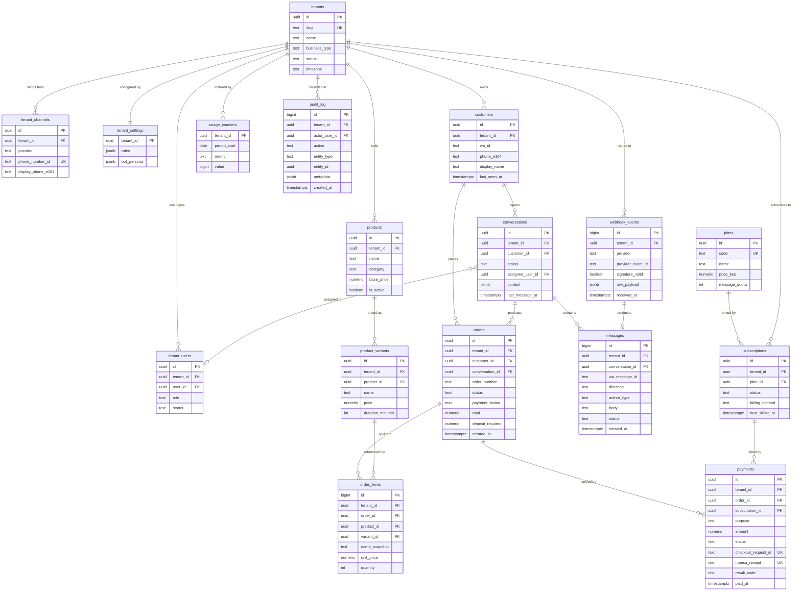
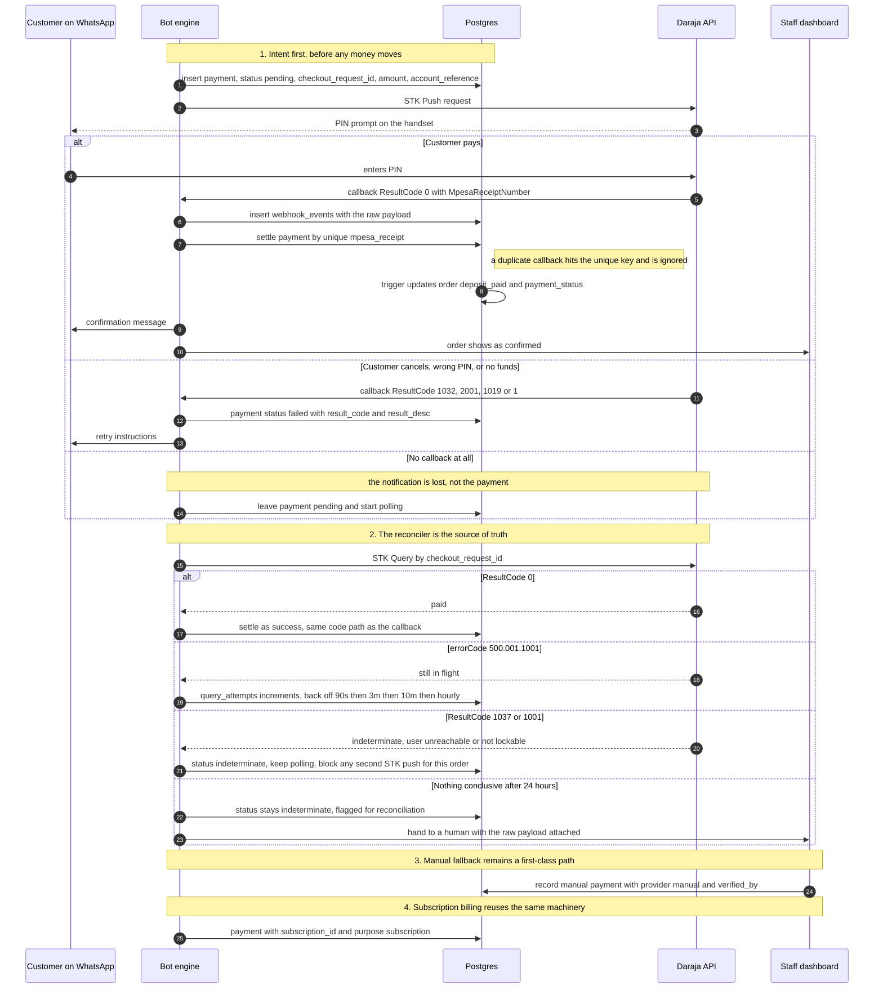

# Database Plan — Multi-Tenant WhatsApp SaaS for Kenyan SMEs

**Status:** Platform design / decision document. **No SQL in this file.** The schema, migrations and RLS policies it describes now exist in Phase 1 — see [`PHASE_1_SAAS_FOUNDATION.md`](./PHASE_1_SAAS_FOUNDATION.md).

> **Repository context.** This plan was written while the platform was still being
> prototyped inside a single-tenant application repository, and it references that
> application's files as the *starting point* it had to absorb. That application is a
> **separate repository** and is not part of this project. The table below is retained as
> design rationale, not as a description of this repository's contents. This repository is
> platform-first and contains no application-specific code.

**Starting point the design had to absorb (single-tenant application, separate repository):**

| Area | File | What the new design must absorb |
|---|---|---|
| Order persistence | `database.py` | SQLite `orders` table, `REAL` money columns, ISO-text timestamps, ad-hoc `ALTER TABLE` patching |
| Chat persistence | `whatsapp_database.py` | `whatsapp_conversations` (PK `wa_id`), `whatsapp_events` (idempotency by `message_id`) |
| Rules/pricing | `business_rules.py`, `catalog.py`, `pricing.py` | Hard-coded `CAKE_PRICES`, 70% deposit, 3-day deadline, KSh 32/km delivery |
| Bot + webhook | `whatsapp_webhook.py`, `whatsapp_agent_service.py`, `notifications.py` | Single `WHATSAPP_PHONE_NUMBER_ID` sends; webhook has no tenant concept |
| Dashboard | `admin_routes.py`, `templates/` | One password for one business; per-row `get_order()` lookups |
| Payments | `verify_payment.py` | Manual human verification — no Daraja/STK code exists yet |

## Contents

1. [Tenancy Model Comparison](#1-tenancy-model-comparison)
2. [Entity List & Relationships](#2-entity-list--relationships)
3. [Column Decisions](#3-column-decisions)
4. [Isolation & Security](#4-isolation--security)
5. [Performance Plan](#5-performance-plan)
6. [Growth Path](#6-growth-path)
7. [Risks](#7-risks)
8. [Suggested MVP Build Sequence](#8-suggested-mvp-build-sequence)
9. [Open Questions](#9-open-questions)
10. [Glossary](#10-glossary)

## 0. Context, assumptions, and sizing

### 0.1 What we are building

One Postgres database hosting ~100 small Kenyan businesses (**tenants**) — bakeries, salons, bus SACCOs — sharing a single WhatsApp bot engine while keeping their data isolated. Each tenant self-onboards through a dashboard, uploads its own products/services, and receives orders over WhatsApp. The platform must support **M-Pesa payments**, **human takeover** of live conversations, and **monthly billing**.

### 0.2 Assumptions

Several decisions below hinge on these. Correct any that are wrong before the schema work starts.

| # | Assumption | Why it matters |
|---|---|---|
| A1 | 100 tenants at steady state; no single tenant exceeds ~5% of platform traffic | If one tenant dominates, noisy-neighbour controls and possibly physical separation change (see §7) |
| A2 | Postgres on Supabase, **free tier** for MVP: 500 MB database, 1 GB file storage, 5 GB egress, 2 active projects, paused after 7 days of inactivity, **no automated backups** | Drives the tenancy recommendation (§1) and the backup strategy (§7) |
| A3 | Backend stays Python/Flask on Railway, dashboard stays React/Vite | The database must fit the existing stack; no rewrite |
| A4 | WhatsApp Cloud API; each tenant has its own WhatsApp Business number, so the webhook's `metadata.phone_number_id` is a reliable tenant key | This edge routing key is what makes tenant isolation possible (§4) |
| A5 | M-Pesa via Safaricom Daraja (STK Push + callbacks); payments are currently verified manually by staff | Payments is net-new work; the existing manual path is retained as a fallback (§8, phase 5) |
| A6 | KES only (no multi-currency in MVP); all timestamps in `Africa/Nairobi` for display | Simplifies money columns and M-Pesa timestamp parsing (§3) |
| A7 | Cindy Bakes becomes tenant #1 — no special-case "legacy mode" | One code path for every tenant; simpler isolation reasoning |
| A8 | ≤ 150 WhatsApp messages/tenant/day and ≤ 20 orders/tenant/day | The sizing model in §0.3 |
| A9 | No data-residency or SOC2 requirement in MVP; Kenya Data Protection Act 2019 applies | Drives consent fields, deletion workflow, and backup handling (§4, §7) |

### 0.3 Sizing — the number that decides everything

Order data is small. **Messages dominate.** Estimates below assume ~600–900 bytes per stored message row including index overhead, with orders, order items, and payments adding roughly 15% of the message footprint.

| Scenario | Messages/day/tenant | Platform messages/month | Retained footprint after a 90-day window |
|---|---|---|---|
| Light | 30 | ~90,000 | ~40 MB |
| Typical | 75 | ~225,000 | ~110 MB |
| Busy | 150 | ~450,000 | ~220 MB |

Three conclusions drive the rest of this document:

1. **Catalogue, customers, and orders are trivial.** A hundred tenants' order history is tens of megabytes. Nothing needs partitioning.
2. **`messages` alone can exhaust a 500 MB free-tier database.** Unbounded, the "busy" scenario crosses 500 MB in roughly two to four months, and then every tenant breaks at once.
3. **A retention and archive policy is therefore an MVP requirement** (§6), not an optimisation. The free tier is viable only with it — and the move to Pro ($25/mo) should happen as paying tenants land, not after an outage (§7).

> These are estimates. Replace them with real numbers from Cindy Bakes' logs after phase 3 of the build sequence, and re-run the arithmetic before committing to a plan tier.

### 0.4 The one rule

Every tenant-owned row carries `tenant_id NOT NULL`, and every read is tenant-scoped. If a proposed feature cannot obey that rule, it needs a design review — not an exception. Everything in §4 and §5 exists to make the rule hard to violate by accident.

## 1. Tenancy Model Comparison

### 1.1 The three candidates

- **Database-per-tenant** — each business gets its own Postgres database (on Supabase, its own *project*).
- **Schema-per-tenant** — one database, one Postgres schema per tenant, switched per connection via `search_path`.
- **Shared schema + `tenant_id`** — one database, one schema, every tenant-owned row carries `tenant_id`, isolation enforced with Row Level Security (RLS).

### 1.2 Comparison

| Criterion | DB-per-tenant | Schema-per-tenant | Shared schema + `tenant_id` ✅ |
|---|---|---|---|
| Isolation strength | Strongest: separate credentials, no shared query path | Strong at SQL level, but one leaked credential can still reach other schemas if grants are sloppy | Logical: enforced by RLS plus application discipline |
| Marginal cost at 100 tenants | **Fatal.** Free tier allows 2 active projects; Pro is $25/mo for the first project and ~$10/mo for each additional → roughly **$1,000/month** at 100 tenants | Free tier is enough — one project | Free tier is enough — one project, ~$0 marginal per tenant |
| Free-tier feasibility | Impossible | Possible | Possible |
| Operational complexity | Very high: 100 migration runs, 100 credential rotations, 100 monitoring surfaces, 100 connection pools | High: 100-way migration fan-out, grant management per schema, custom tooling | Low: one migration set, one pool, one monitoring surface |
| Cost of a schema change | Run migrations 100× and verify 100× | Run migrations 100× (scriptable, still risky) | Run once |
| Connection impact | 100 pools against a limited connection budget | One pool, but `search_path` must be set per checkout | One pool, pooler-friendly |
| Supabase platform fit | Good in principle, blocked by the project cap | **Poor.** Auth, PostgREST, Storage and Realtime assume the `public` schema plus JWT claims; Studio's table editor becomes unusable with 100 schemas | **Native.** RLS + JWT claims is Supabase's documented multi-tenant pattern |
| Backup granularity | Per-project, but free tier has **no automated backups** anyway | Whole database (no per-tenant restore) | Whole database (no per-tenant restore) |
| Cross-tenant reporting (platform MRR, churn, message volume) | Painful: federated queries or foreign data wrappers across 100 projects | Painful: `UNION ALL` across 100 schemas, or a rollup pipeline | Trivial: one `GROUP BY tenant_id` |
| Onboarding a new tenant | Provision a project, run migrations, wire secrets — minutes to hours, manual | Create schema and seed it — seconds, scriptable | Insert a row — instant |
| Blast radius of one bug | Contained to a single tenant | Can leak across tenants | Can leak **platform-wide** — this is the real cost |
| Verdict | **Reject** | **Reject** | **Recommend** |

### 1.3 Recommendation: shared schema with `tenant_id` and forced RLS

For 100 small businesses on a free-tier budget, shared schema is the only option whose cost and operational load are sustainable, and it is the shape Supabase's own tooling is designed around.

**Why it wins for this specific case:**

1. **Cost.** DB-per-tenant is ~$1,000/month at 100 tenants before a single line of code. Schema-per-tenant technically fits the free tier, but it buys complexity instead of isolation: backups, disk, and compute stay shared either way, so you pay the isolation tax without the isolation benefit.
2. **Complexity per tenant.** Onboarding must be self-serve — a tenant-insert versus provisioning a project or schema is the difference between a funnel that converts and an ops queue.
3. **Volume.** 100 small businesses is *small*. Total order data is tens of megabytes (§0.3). This is nowhere near the scale where physical separation earns its keep.
4. **Platform fit.** RLS plus JWT claims (`auth.jwt()`) is a first-class Supabase pattern; schema-per-tenant fights Auth, PostgREST, Storage, and the Studio UI.
5. **Billing and analytics.** The platform itself needs cross-tenant queries (who is overdue, what is our message volume, which tenants are near quota). Shared schema makes these one query; the other models make them a project.

**The honest cost:** in a shared schema, one bad query or one misconfigured policy can expose tenant A's data to tenant B — or to everyone. That risk is real and it is why §4 (isolation), §5 (performance) and the isolation test harness are non-negotiable parts of this plan rather than polish.

### 1.4 The escape hatch

Every tenant-owned row keeps an explicit `tenant_id`, and nothing is keyed in a way that assumes a single shared namespace beyond that. This keeps extraction cheap: any tenant that outgrows the shared database — a whale, or a SACCO with regulatory obligations — can be moved to its own schema or project by copying rows filtered on one column, with no schema redesign.

### 1.5 What we explicitly reject for MVP

- No database-per-tenant, no project-per-tenant.
- No schema-per-tenant.
- No "hybrid" (e.g. shared for small tenants, dedicated for large ones) — that doubles the migration and code paths for a problem we do not yet have.

## 2. Entity List & Relationships

### 2.1 Entity map

**17 entities in five groups.** "Tenancy" states how each is scoped — `tenant` means the row belongs to one business and carries `tenant_id`.

| Group | Entity | Tenancy | Purpose in one line |
|---|---|---|---|
| Platform | `plans` | global | The platform's own pricing tiers (message quota, seat limit, KES price) |
| Tenant identity & access | `tenants` | root | The business itself — the anchor every other row points to |
| | `tenant_channels` | tenant | WhatsApp sending identity per tenant; **holds the `phone_number_id` webhook routing key** |
| | `tenant_users` | tenant | Dashboard logins and their role (owner/manager/staff/agent) |
| | `tenant_settings` | tenant (1:1) | Per-tenant business rules and vertical config (`jsonb`) |
| | `audit_log` | tenant | Append-only record of sensitive actions (takeover, payment verification, price override) |
| Billing | `subscriptions` | tenant | Monthly plan state, period, billing method, dunning status |
| | `usage_counters` | tenant | Metered counts per period (outbound messages, orders, AI tokens) for quotas and billing |
| Catalogue | `products` | tenant | What the tenant sells — cake flavour, salon service, SACCO route |
| | `product_variants` | tenant | Priced options under a product — 1kg/2kg/3kg, 30/60 min, ordinary/VIP |
| Customers & chat | `customers` | tenant | A person who has messaged this tenant (isolated per tenant, deliberately) |
| | `conversations` | tenant | One WhatsApp thread with one customer; bot vs human state lives here |
| | `messages` | tenant | Every inbound/outbound message — **the volume table** |
| | `webhook_events` | platform (tenant nullable) | Raw inbound webhook payload, signature verdict, idempotency, replay |
| Commerce | `orders` | tenant | An order's header: status, money totals, fulfilment, schedule |
| | `order_items` | tenant | Order lines with **price snapshots** so history survives price changes |
| | `payments` | tenant | M-Pesa intents and results, plus subscription charges and manual verifications |

### 2.2 What each entity holds

**`tenants`** — `id`, `slug` (unique, for URLs), `name`, `business_type` (`bakery` | `salon` | `sacco` | `other`), `status` (`onboarding` | `active` | `suspended` | `churned`), city/county, `timezone` (default `Africa/Nairobi`), `currency` (default `KES`), `trial_ends_at`, `suspended_at`, timestamps. Everything else hangs off this row.

**`tenant_channels`** — `id`, `tenant_id`, `provider` (`meta_cloud`), `phone_number_id` (**globally unique — the webhook routing key**), `waba_id`, `display_phone_e164`, credential reference, `status`, `is_default`. Separate from `tenants` because a tenant may later run more than one number, or swap numbers without touching the tenant row.

**`tenant_users`** — `user_id` (references the Supabase auth user), `tenant_id`, `role` (`owner` | `manager` | `staff` | `agent`), `status`, `invited_at`, `last_active_at`. Unique on `(tenant_id, user_id)`. This table is the source of truth for "which tenants may this login see" (§4).

**`tenant_settings`** — one row per tenant: `rules` `jsonb` carrying the values currently hard-coded in `business_rules.py` and `catalog.py` — `deposit_rate`, `deposit_deadline_days`, `delivery_rate_per_km`, `personalisation_prices`, `business_hours`, `vertical_config` (salon staff roster, SACCO stages and seat classes) — plus `bot_persona` `jsonb` (greeting, tone, escalation rules) and notification preferences.

**`plans`** — the platform's own catalogue, not tenant data: `code`, `name`, `price_kes`, `message_quota`, `seat_limit`, `is_active`. Global because it belongs to *us*, not to a business — this is the one catalogue that deliberately has no `tenant_id`.

**`products` / `product_variants`** — replaces the hard-coded `CAKE_PRICES` dict. `products`: `tenant_id`, `name`, `description`, `category`, `base_price`, `is_active`, `image_path`, `sort_order`. `product_variants`: `tenant_id`, `product_id`, `name`, `price`, `duration_minutes` (nullable; salons), `attributes` `jsonb` (vertical extras), `is_active`, `sort_order`; unique on `(tenant_id, product_id, name)`. A cake flavour maps to a product with 1/2/3 kg variants; a braiding service to 30/60-minute variants; a SACCO route to a product with ordinary/VIP variants.

**`customers`** — `tenant_id`, `wa_id` (digits, exactly as WhatsApp sends it), `phone_e164`, `display_name`, `notes`, `marketing_opt_in` + `consent_at` (Kenya DPA), `first_seen_at`, `last_seen_at`, `blocked_at`. Unique on `(tenant_id, wa_id)` **and** `(tenant_id, phone_e164)`. The same human is deliberately a *different* customer row at each tenant — that is the privacy win, not a bug.

**`conversations`** — `tenant_id`, `customer_id`, `status` (`bot` | `human` | `closed`), `assigned_user_id`, `last_message_at`, `last_inbound_at`, `human_takeover_at`, `context` `jsonb` (the order draft today serialised into `whatsapp_conversations.draft_json` and `input_items_json`), `unread_count`. One open thread per customer per tenant.

**`messages`** — `tenant_id`, `conversation_id`, `wa_message_id`, `direction` (`in` | `out`), `author_type` (`customer` | `bot` | `human`), `author_user_id`, `message_type` (`text` | `image` | `interactive` | `template` | `location` | `document`), `body`, `media_path`, `status` (`queued` | `sent` | `delivered` | `read` | `failed`), `error_code`, `created_at`. Append-only; unique on `(tenant_id, wa_message_id)`.

**`webhook_events`** — `provider`, `provider_event_id`, `signature_valid`, `phone_number_id`, `tenant_id` (**nullable — see §4.5**), `event_type`, `raw_payload` `jsonb`, `received_at`, `processed_at`, `processing_status`, `error_message`. Unique on `(provider, provider_event_id)`. Kept for idempotency *and* replay: when settlement logic is fixed later, stored payloads can be re-run.

**`orders`** — `tenant_id`, `customer_id`, `conversation_id`, `order_number` (human-readable, unique **per tenant**: `CB-2026-0001`), `status` (`draft` | `pending_payment` | `confirmed` | `in_progress` | `ready` | `completed` | `cancelled`), `payment_status` (`unpaid` | `deposit_paid` | `paid` | `overdue`), `fulfilment` (`pickup` | `delivery`), delivery fields (`origin`, `location`, `distance_km`, `rate_per_km`, `delivery_cost`), `currency`, `subtotal`, `total`, `deposit_required`, `deposit_paid`, `balance_due`, `scheduled_for`, `notes`, `cancelled_at`, timestamps. Maps onto today's `orders` table with the money columns retyped and `tenant_id` added.

**`order_items`** — `tenant_id`, `order_id`, `product_id`, `variant_id`, `name_snapshot`, `unit_price`, `quantity`, `line_total`, `attributes` `jsonb` (personalisation type, cake message, colours), `notes`. Snapshots mean a price rise next month cannot rewrite last month's invoices.

**`payments`** — `tenant_id`, `order_id` (nullable), `subscription_id` (nullable), `purpose` (`deposit` | `balance` | `subscription` | `other`), `provider` (`mpesa_stk` | `mpesa_c2b` | `manual`), `amount`, `currency`, `status` (`pending` | `success` | `failed` | `indeterminate` | `cancelled` | `reversed`), `checkout_request_id` (unique), `merchant_request_id`, `mpesa_receipt` (unique), `msisdn`, `result_code`, `result_desc`, `account_reference`, `paid_at`, `raw_payload` `jsonb`, `verified_by`, timestamps. Replaces today's boolean `payment_verified` flag with an auditable record.

**`subscriptions`** — `tenant_id`, `plan_id`, `status` (`trialing` | `active` | `past_due` | `suspended` | `cancelled`), `current_period_start`/`end`, `billing_method` (`mpesa_stk` | `manual`), `next_billing_at`, `cancelled_at`. At most one non-cancelled row per tenant.

**`usage_counters`** — `tenant_id`, `period_start` (first day of the billing month), `metric` (`messages_out` | `messages_in` | `orders` | `ai_tokens`), `value`. Unique on `(tenant_id, period_start, metric)`. Incremented as work happens, so quotas and invoices never require scanning the message table.

**`audit_log`** — `tenant_id`, `actor_user_id`, `action` (e.g. `conversation.takeover`, `payment.verify`, `order.price_override`, `staff.invite`), `entity_type`, `entity_id`, `metadata` `jsonb`, `created_at`. Append-only: there is deliberately **no** update or delete policy for it (§4.6).

### 2.3 Why these splits (not fewer, not more tables)

- **`tenant_channels` split from `tenants`:** the webhook must resolve a number to a business on the hottest path in the system, and numbers change. A dedicated unique key on `phone_number_id` makes routing a point lookup and keeps it independent of tenant-profile edits.
- **`order_items` instead of a `jsonb` blob on `orders`:** every vertical sells *several* things per order, and price history must survive catalogue edits. "Top products this month" is a real dashboard query — that needs rows, not an embedded document.
- **`payments` separate from `orders`:** one order can have a deposit *and* a balance payment, a tenant can be billed monthly with no order at all, and M-Pesa hands you provider references that must be uniquely constrained. Money also has a longer retention and audit life than the workflow state that produced it.
- **`usage_counters` instead of counting `messages`:** dashboards and quota checks must never `COUNT(*)` over the volume table (§5).
- **`tenant_settings` as `jsonb` rather than ~40 columns:** bakery, salon and SACCO rules genuinely differ. Columns would mean a sparse, migration-churning table; `jsonb` holds only the differing parts while every *queried* field (tenant, status, money, timestamps) stays a real column (§3.1).

### 2.4 How the entities link

Read these as the tenancy chain plus three verticals hanging off it:

- **Tenancy chain:** `tenants` → `tenant_channels`, `tenant_users`, `tenant_settings`, `audit_log`. Deleting a tenant cascades through all of them.
- **Catalogue:** `tenants` → `products` → `product_variants`.
- **Conversation vertical:** `tenants` → `customers` → `conversations` → `messages` (one thread, many messages), with `conversations` optionally assigned to a `tenant_users` row when a human takes over.
- **Commerce vertical:** `conversations` → `orders` → `order_items` → (`products`, `product_variants`); `orders` → `payments`; `customers` → `orders`.
- **Billing vertical:** `plans` → `subscriptions` → `tenants`; `payments` → (`orders` *or* `subscriptions`); `usage_counters` → `tenants`.
- **Edge:** `webhook_events` → `messages` (what an inbound event produced) and → `tenants` (once routed).

Three deliberate cross-links worth naming:

1. `payments.order_id` and `payments.subscription_id` are both nullable and mutually exclusive in practice — one payment row either pays for a customer's order or for a tenant's monthly plan. This is what lets one M-Pesa pipeline serve both.
2. `orders.conversation_id` ties a sale back to the WhatsApp thread that produced it, which is the whole value proposition of the product ("orders via WhatsApp").
3. `messages.author_user_id` is set only when `author_type = 'human'`, giving a per-staff activity trail for takeover.

### 2.5 Schema diagram (ERD)



**Reading the diagram.** `||--o{` means one-to-zero-or-many (a tenant has many products); `||--||` is one-to-exactly-one (`tenant_settings`); `}o--o|` is zero-or-one (a conversation may be assigned to a staff member, or not). `PK`/`FK`/`UK` are primary, foreign and unique keys.

**Types in the diagram are indicative, not final** — precision, nullability, defaults and check constraints are specified in §3. Amounts shown as `numeric` are `numeric(12,2)` KES (§3.3); IDs shown as `uuid` use `gen_random_uuid()`, while high-volume append tables (`messages`, `order_items`, `audit_log`, `webhook_events`) use `bigint` identity for smaller, faster indexes (§3.1).

**The tenancy invariant, shown once here:** every entity above carries `tenant_id NOT NULL → tenants.id` **except** `plans` (platform-owned catalogue) and `webhook_events` (platform-owned, `tenant_id` nullable until the payload is routed — §4.5). `tenant_id` is omitted from most attribute blocks above only for width; it is never optional on a tenant-scoped table.

## 3. Column Decisions

### 3.1 Cross-cutting rules

These apply to every table. The right-hand column names what is being *fixed* in the current code, because the existing SQLite schema contains three habits we must not carry over.

| Decision | Rule for this platform | Why (and what it fixes) |
|---|---|---|
| Primary keys — low volume | `uuid` default `gen_random_uuid()` on `tenants`, `tenant_channels`, `tenant_users`, `products`, `product_variants`, `customers`, `conversations`, `orders`, `payments`, `plans`, `subscriptions` | Non-enumerable IDs are safe to expose in dashboard URLs, WhatsApp deep links and webhook payloads, and they merge cleanly across environments. Today's `INTEGER PRIMARY KEY AUTOINCREMENT` leaks "how many orders has this platform ever taken" to anyone who counts |
| Primary keys — high volume | `bigint` identity on `messages`, `order_items`, `webhook_events`, `audit_log`, `usage_events` (future) | Sequential integers make for narrower, faster index entries and cheaper inserts on append-only tables. UUIDs' randomness costs write amplification exactly where volume is highest |
| **`text` vs `varchar`** | Use `text` almost everywhere. Add a `CHECK` constraint or a lookup table for allowed values. Reach for `varchar(n)` only when a real business limit exists and you want the database to enforce it | In Postgres there is **no performance difference** between `text` and `varchar(n)` — the same varlena storage. `varchar(255)` is cargo-culting; a wrong `varchar(50)` on a tenant name is a production incident and an `ALTER TABLE` on a live table |
| **`numeric` vs `int` vs `float`** | Money and rates: `numeric`. Counts and quantities: `integer`. **Never `real`/`double precision` for money** | Floats cannot represent 0.1 exactly, so sums drift and paid-versus-owed comparisons fail at the cent. The current schema stores `subtotal`, `required_deposit`, `delivery_cost` as SQLite `REAL` — that is the single most important type change in this plan |
| **Timestamps** | `timestamptz` with `now()` default; every timestamp column ends in `_at`; dates (a scheduled order day) use `date` | Today's schema stores ISO **strings** in `TEXT` columns, so ordering and range filters are string comparisons waiting to be wrong. `timestamptz` gives correct ordering, timezone-safe arithmetic, and one unambiguous instant regardless of server locale |
| Timezone | Store UTC instants; keep `tenants.timezone` (default `Africa/Nairobi`) and convert for display and daily cut-offs | Kenyan users think in EAT (UTC+3) while servers often run UTC. Month-end and payment-deadline logic must agree with the tenant's calendar |
| **`jsonb` vs separate table** | **If you filter, join, sort, aggregate or constrain on it, it is a column. If you only ever display it whole, it is `jsonb`.** | `tenant_settings.rules`, `conversations.context`, `order_items.attributes` and `*.raw_payload` are display/config blobs — perfect `jsonb`. `status`, `amount`, `tenant_id`, `phone_e164` are queried constantly — they must never hide inside JSON, where they need expression indexes, cannot be constrained cleanly, and cannot be joined |
| Enums | `text` + `CHECK (col IN (...))` (or a small lookup table for statuses a tenant can customise). **Avoid Postgres native `ENUM` types** | Native enums need `ALTER TYPE ... ADD VALUE` (historically non-transactional) before any migration touching them. With three verticals whose statuses will diverge, `text` + `CHECK` keeps migrations boring and lets salon and SACCO workflows evolve without touching shared types |
| Phone numbers | Store **two** forms: `phone_e164` (`+254712345678`) and the provider's `wa_id` (digits, `254712345678`). `text`, never numeric | Leading `+` and leading zeros are lost if you store numbers as integers; WhatsApp sends `wa_id` without the plus and Kenyan users type `0712…`, `712…`, and `+254712…`. All three must normalise on write, and the raw form should be kept for debugging if normalisation ever guesses wrong |
| Currency | `currency` `text` default `'KES'` on tenant, order and payment rows; MVP accepts KES only | Costs one cheap column now; retrofitting multi-currency later without it means backfilling every historical amount with a guessed currency. `CHAR(3)` is the ISO habit but `text` + `CHECK` is simpler and equally safe |
| Soft vs hard delete | Catalogues: `is_active` boolean (never destroy a product referenced by history). Orders and payments: never deleted, use `status` + `cancelled_at`. Customers: `blocked_at`, plus a real DPA deletion path (§4.8) | An order that silently disappears because someone deleted a product is a money dispute. Conversely, DPA "right to erasure" needs genuine deletion of personal data — so we soft-delete operational records but hard-delete personal identifiers on request |
| Derived money | Use generated columns for arithmetic that must never disagree (`line_total = unit_price * quantity`, `balance_due = total - deposit_paid`) — never hand-computed in application code | The dashboard currently recomputes `total_order_amount` and `remaining_balance` in Python (`admin_routes.py`) from separate fields. Two places computing the same money value eventually disagree |
| Naming | `snake_case`; plural table names; `*_at` timestamptz; `*_km`, `*_kes` where the unit is not obvious; `is_*`/`has_*` booleans (`is_active`, never `active`); `time`/`date` reserved words avoided (`scheduled_for`, not `date_needed` — clearer than today's name) | Consistent naming is what makes a 17-table schema navigable and makes the isolation test suite (§4.7) writable by rule rather than by memory |
| `NOT NULL` discipline | `NOT NULL` + explicit `DEFAULT` on everything that is always present; nullable only when absence is meaningful (e.g. `payments.paid_at` before payment) | Every nullable column is a branch the application must handle forever. Let the database reject impossible rows |

### 3.2 Per-table column decisions

Only columns whose type is a real decision are annotated; obvious ones are listed for completeness.

#### `tenants`

| Column | Type | Why this type |
|---|---|---|
| `id` | `uuid` PK, default `gen_random_uuid()` | Appears in dashboard URLs and onboarding links; must not be guessable or countable |
| `slug` | `text` UNIQUE, `CHECK` (lowercase, 3–40 chars) | Human-readable tenant handle for routing and support; uniqueness enforced by the database, not the app |
| `name` | `text NOT NULL` | No arbitrary length cap; a `varchar(50)` here is a Kenyan business called "Mama Ngina Quality Cakes & Catering Ltd" waiting to fail |
| `business_type` | `text NOT NULL CHECK IN ('bakery','salon','sacco','other')` | Drives which vertical config the bot loads. `text` + `CHECK` rather than a native enum so adding a vertical is a normal migration |
| `status` | `text NOT NULL DEFAULT 'onboarding' CHECK IN ('onboarding','active','suspended','churned')` | Suspension must be enforceable at the row level (a suspended tenant's bot stops replying) |
| `county` / `city` | `text` | Display and delivery-origin defaults; keep separate from `tenant_settings` because it is profile data, not rules |
| `timezone` | `text NOT NULL DEFAULT 'Africa/Nairobi'` | Timestamps are stored UTC; this drives display and daily cut-offs |
| `currency` | `text NOT NULL DEFAULT 'KES'` | Present from day one so multi-currency is a data change, not a migration of history |
| `trial_ends_at`, `suspended_at` | `timestamptz` (nullable) | Nullable is meaningful here: "never suspended" |
| `created_at`, `updated_at` | `timestamptz NOT NULL DEFAULT now()` | `updated_at` maintained by trigger, not by every code path remembering |

#### `tenant_channels`

| Column | Type | Why this type |
|---|---|---|
| `id` | `uuid` PK | — |
| `tenant_id` | `uuid NOT NULL REFERENCES tenants(id) ON DELETE CASCADE` | Cascade is correct: a channel cannot exist without its tenant |
| `provider` | `text NOT NULL DEFAULT 'meta_cloud' CHECK IN ('meta_cloud')` | Room for a future second provider without renaming columns |
| `phone_number_id` | `text NOT NULL UNIQUE` | **The single most important index in the system.** The inbound webhook carries `metadata.phone_number_id`; this unique key turns "which tenant is this?" into a point lookup and makes an accidental duplicate-number onboarding impossible |
| `waba_id` | `text` | Needed to send via the Cloud API; kept as text because Meta IDs are opaque strings |
| `display_phone_e164` | `text` | What the tenant advertises; `text` because of the leading `+` |
| `credentials_ref` | `text` | **A reference, not the secret.** The access token lives in Supabase Vault / an encrypted store; the column only names the vault entry. Storing a WhatsApp token in plaintext in a shared multi-tenant table is unacceptable (§4.4) |
| `status` | `text NOT NULL DEFAULT 'pending' CHECK IN ('pending','verified','disabled')` | A number can be connected before Meta verification completes |
| `is_default` | `boolean NOT NULL DEFAULT true` | One number per tenant today; the flag keeps the multi-number future from being a schema change |

#### `tenant_users`

| Column | Type | Why this type |
|---|---|---|
| `id` | `uuid` PK | — |
| `tenant_id` | `uuid NOT NULL REFERENCES tenants(id) ON DELETE CASCADE` | — |
| `user_id` | `uuid NOT NULL REFERENCES auth.users(id) ON DELETE CASCADE` | Supabase Auth owns identity; we never store passwords or tokens in our own tables |
| `role` | `text NOT NULL CHECK IN ('owner','manager','staff','agent')` | `owner` can bill and invite; `staff` works orders; `agent` is chat-only. Roles drive RLS policy predicates (§4) |
| `status` | `text NOT NULL DEFAULT 'invited' CHECK IN ('invited','active','disabled')` | A disabled login must lose access without deleting the audit trail |
| UNIQUE | `(tenant_id, user_id)` | One membership per login per tenant; makes membership checks a unique index hit |
| `invited_at`, `last_active_at` | `timestamptz` | Support questions like "did they ever log in?" are answered from data, not from logs with 1-day retention |

#### `tenant_settings`

| Column | Type | Why this type |
|---|---|---|
| `tenant_id` | `uuid` PK, `REFERENCES tenants(id) ON DELETE CASCADE` | One row per tenant, so `tenant_id` *is* the primary key — no surrogate `id` needed |
| `rules` | `jsonb NOT NULL DEFAULT '{}'` | Holds `deposit_rate`, `deposit_deadline_days`, `delivery_rate_per_km`, `personalisation_prices`, `business_hours`, `vertical_config`. These are read as a whole by the bot, differ per vertical, and would otherwise be ~40 half-empty columns. Values are validated on write by the application against a per-`business_type` shape |
| `bot_persona` | `jsonb NOT NULL DEFAULT '{}'` | Greeting, tone, escalation triggers — pure configuration, read whole |
| `updated_at` | `timestamptz NOT NULL DEFAULT now()` | Config changes are a support-debug breadcrumb |

> **Rule reminder:** anything that later needs filtering *across* tenants (e.g. "all tenants with a deposit rate above 50%") must be promoted out of `jsonb` into a real column, because a platform-wide query over `jsonb` cannot use a normal index efficiently.

#### `products`

| Column | Type | Why this type |
|---|---|---|
| `tenant_id` | `uuid NOT NULL REFERENCES tenants(id) ON DELETE CASCADE` | Always the second column after the PK, on every tenant table — a convention the isolation tests rely on |
| `name` | `text NOT NULL` | — |
| `description` | `text` | — |
| `category` | `text` | Free text per tenant ("Cakes", "Braids", "Nairobi–Kisumu"). Not a `CHECK` list, because categories are tenant-defined |
| `base_price` | `numeric(12,2) NOT NULL CHECK (base_price >= 0)` | The "from" price shown when a product has variants. `numeric`, never `real` |
| `is_active` | `boolean NOT NULL DEFAULT true` | Deactivate instead of delete, so historical order items still resolve |
| `image_path` | `text` | A **path** into Supabase Storage, not a URL and not base64 bytes. Signed URLs are generated per request so one tenant can never fetch another's image by guessing a path (§4.4) |
| `sort_order` | `integer NOT NULL DEFAULT 0` | Tenants care about catalogue order; a cheap integer beats an alphabetical accident |
| UNIQUE | `(tenant_id, lower(name))` | The old `find_flavour()` matched case-insensitively by scanning a dict; a case-insensitive unique index stops "Chocolate" and "chocolate" becoming two products |

#### `product_variants`

| Column | Type | Why this type |
|---|---|---|
| `product_id` | `uuid NOT NULL REFERENCES products(id) ON DELETE CASCADE` | — |
| `name` | `text NOT NULL` | `1kg`, `2kg`, `3kg`, `30 min`, `Ordinary`, `VIP` |
| `price` | `numeric(12,2) NOT NULL CHECK (price >= 0)` | The only price the bot may quote. Replaces `CAKE_PRICES[flavour][weight]` — same information, tenant-editable via the dashboard |
| `duration_minutes` | `integer` (nullable) | Null for a bakery; meaningful for a salon. Nullable because its absence is genuinely meaningful |
| `attributes` | `jsonb NOT NULL DEFAULT '{}'` | Vertical extras that are displayed, not queried: seat class, staff level, allergen notes |
| UNIQUE | `(tenant_id, product_id, name)` | Includes `tenant_id` as belt-and-braces even though `product_id` already implies a tenant |

#### `customers`

| Column | Type | Why this type |
|---|---|---|
| `wa_id` | `text NOT NULL` | Exactly as WhatsApp sends it (`254712345678`); matching the provider's format avoids a translation step on the hottest read path |
| `phone_e164` | `text NOT NULL` | Normalised `+254…` for display, M-Pesa matching and deduplication |
| `display_name` | `text` | From the WhatsApp profile; may be absent |
| `notes` | `text` | Staff notes ("allergic to nuts", "always pays late") |
| `marketing_opt_in` | `boolean NOT NULL DEFAULT false` | Kenya DPA 2019: consent must be explicit and recorded, not assumed |
| `consent_at` | `timestamptz` | When consent was given — the evidence behind the boolean |
| `first_seen_at`, `last_seen_at` | `timestamptz NOT NULL DEFAULT now()` | Powers "recent customers" without touching `messages` |
| `blocked_at` | `timestamptz` | Harassment/spam control; a blocked customer's messages are still stored but the bot stays silent |
| UNIQUE | `(tenant_id, wa_id)` **and** `(tenant_id, phone_e164)` | Prevents one person becoming two customer rows in the same tenant after a formatting difference — while still allowing the same person to be a distinct customer at two tenants (the deliberate privacy boundary) |

#### `conversations`

| Column | Type | Why this type |
|---|---|---|
| `customer_id` | `uuid NOT NULL REFERENCES customers(id)` | — |
| `status` | `text NOT NULL DEFAULT 'bot' CHECK IN ('bot','human','closed')` | The human-takeover state machine. A crashed process cannot lose it because it is data, not memory |
| `assigned_user_id` | `uuid REFERENCES tenant_users(id)` (nullable) | Set when a human takes over; nullable means "no one is handling this" |
| `human_takeover_at` | `timestamptz` | How long customers wait for a human is a support metric; measure it, do not guess |
| `context` | `jsonb NOT NULL DEFAULT '{}'` | Direct replacement for `whatsapp_conversations.draft_json` + `input_items_json`: the in-progress order draft and bot state. Read and rewritten whole each turn, never queried inside → textbook `jsonb`. (Today these are two `TEXT` columns holding JSON strings; `jsonb` validates on write and can be inspected in Studio) |
| `last_message_at`, `last_inbound_at` | `timestamptz` | `last_message_at` powers inbox ordering; `last_inbound_at` powers the **24-hour WhatsApp session window** rule — free-form replies are only allowed within 24 hours of the customer's last message, otherwise a template is required (§7) |
| `unread_count` | `integer NOT NULL DEFAULT 0` | A counter instead of `COUNT(*)` on `messages` for every dashboard render |
| PARTIAL UNIQUE | `(tenant_id, customer_id) WHERE status <> 'closed'` | One open thread per customer per tenant, enforced by the database rather than by hope |

#### `messages` (the volume table)

| Column | Type | Why this type |
|---|---|---|
| `id` | `bigint` identity PK | High-volume append; smaller index, sequential inserts (§3.1) |
| `conversation_id` | `uuid NOT NULL REFERENCES conversations(id) ON DELETE CASCADE` | — |
| `wa_message_id` | `text NOT NULL` | Meta's message ID; also used to correlate delivery-status callbacks |
| `direction` | `text NOT NULL CHECK IN ('in','out')` | — |
| `author_type` | `text NOT NULL CHECK IN ('customer','bot','human')` | Distinguishes AI replies from staff replies — needed to audit, tune and bill |
| `author_user_id` | `uuid REFERENCES tenant_users(id)` (nullable) | Populated only for `human`; nullable is meaningful |
| `message_type` | `text NOT NULL CHECK IN ('text','image','interactive','template','location','document')` | Drives rendering, and whether billing counts a session or a template message |
| `body` | `text` | **The reason the retention policy exists.** `text` has no penalty for the first 127 bytes and compresses well, but this column is what grows the database |
| `media_path` | `text` | Storage path, never bytes in the database — inline base64 would multiply the volume problem |
| `status` | `text NOT NULL DEFAULT 'queued' CHECK IN ('queued','sent','delivered','read','failed')` | Updated by status callbacks; `failed` + `error_code` is how you debug "the customer says they got nothing" |
| `error_code` | `text` | Meta error codes are strings; keep them verbatim |
| `created_at` | `timestamptz NOT NULL DEFAULT now()` | — |
| UNIQUE | `(tenant_id, wa_message_id)` | Idempotency: a redelivered webhook inserts nothing instead of duplicating a customer message. Generalises the existing `whatsapp_events.message_id` trick |
| FUTURE PARTITION KEY | `created_at` | Not partitioned in MVP; this is the column the future partition scheme will use (§6) |

#### `orders`

| Column | Type | Why this type |
|---|---|---|
| `customer_id` | `uuid NOT NULL REFERENCES customers(id)` | Not cascading: a customer with order history is never hard-deleted (DPA erasure anonymises instead — §4.8) |
| `conversation_id` | `uuid REFERENCES conversations(id)` (nullable) | Nullable because staff can create an order from the dashboard on a customer's behalf, with no live thread |
| `order_number` | `text NOT NULL` | Human-facing (`CB-2026-0001`), per-tenant sequence. Staff say it on the phone; nobody says a UUID. Unique on `(tenant_id, order_number)` |
| `status` | `text NOT NULL DEFAULT 'draft' CHECK IN ('draft','pending_payment','confirmed','in_progress','ready','completed','cancelled')` | Replaces the current free-ish `order_status` strings with one enforceable list. `draft` = bot is still collecting; `pending_payment` = awaiting deposit |
| `payment_status` | `text NOT NULL DEFAULT 'unpaid' CHECK IN ('unpaid','deposit_paid','paid','overdue')` | Kept as a denormalised fast filter, but **derived from `payments` rows** by trigger so it can never disagree with the money records |
| `fulfilment` | `text NOT NULL CHECK IN ('pickup','delivery')` | Drives the delivery-charge logic that is currently inferred from a string in `order.py` |
| `delivery_origin`, `delivery_location` | `text` | Origin is the tenant's base (today hard-coded to the Mlolongo address in `business_rules.py`); location is what the customer said |
| `delivery_distance_km` | `numeric(8,3)` | Driving distance in km, `numeric` not `real`, and 3 decimals because 0.1 km × KSh 32 is real money |
| `delivery_rate_per_km` | `numeric(12,2)` | **Snapshot** of the rate at order time. If a tenant raises it to KSh 40, old orders must not silently change |
| `delivery_cost` | `numeric(12,2) NOT NULL DEFAULT 0` | Set only after staff confirm (the current model already treats delivery as human-confirmed) |
| `currency` | `text NOT NULL DEFAULT 'KES'` | — |
| `subtotal` | `numeric(12,2) NOT NULL CHECK (subtotal >= 0)` | Sum of order items, snapshot-priced |
| `total` | `numeric(12,2) NOT NULL` | `subtotal + delivery_cost`; use a generated column so no code path can compute it differently |
| `deposit_required` | `numeric(12,2) NOT NULL` | `subtotal × tenant deposit_rate` at order time — snapshot, because the rule can change |
| `deposit_paid` | `numeric(12,2) NOT NULL DEFAULT 0` | Maintained from successful `payments` rows by trigger; never typed in by hand |
| `balance_due` | `numeric(12,2)` GENERATED | `total - deposit_paid`. Replaces the dashboard's Python arithmetic (`admin_routes.py` recomputes `remaining_balance` on the fly) |
| `scheduled_for` | `date` | A pickup/delivery **day**, not an instant — using `date` avoids the "is 12 Aug midnight EAT or UTC?" bug class entirely. Renamed from today's `date_needed` |
| `notes` | `text` | Free-text staff/customer notes |
| `cancelled_at` | `timestamptz` | Nullable; drives the overdue-cancellation workflow that currently lives in `payment_deadline_job.py` |
| `created_at`, `updated_at` | `timestamptz NOT NULL DEFAULT now()` | — |

#### `order_items`

| Column | Type | Why this type |
|---|---|---|
| `order_id` | `uuid NOT NULL REFERENCES orders(id) ON DELETE CASCADE` | Line items are meaningless without their order |
| `product_id` / `variant_id` | `uuid REFERENCES products(id)` / `REFERENCES product_variants(id)` (nullable) | Nullable so a *deleted* or retired product still resolves via the snapshot below, and so ad-hoc line items ("extra candles") remain possible |
| `name_snapshot` | `text NOT NULL` | The product name as the customer saw it. Without this, renaming "Black Forest" next month rewrites history |
| `unit_price` | `numeric(12,2) NOT NULL CHECK (unit_price >= 0)` | Snapshot price, so a later price change cannot alter a paid order |
| `quantity` | `integer NOT NULL CHECK (quantity > 0)` | — |
| `line_total` | `numeric(12,2)` GENERATED | `unit_price * quantity` — one definition, used by reports and invoices |
| `attributes` | `jsonb NOT NULL DEFAULT '{}'` | The personalisation fields that are currently separate columns (`personalisation_type`) live here per line: `{"personalisation":"edible_print","message":"Happy Birthday Wanjiku"}`. Displayed, not aggregated |
| `notes` | `text` | Per-line instruction ("no nuts in this one") |

#### `payments`

| Column | Type | Why this type |
|---|---|---|
| `order_id` | `uuid REFERENCES orders(id)` (nullable) | One order has a deposit payment **and** a balance payment; nullable because subscription charges have no order |
| `subscription_id` | `uuid REFERENCES subscriptions(id)` (nullable) | The other side of the same coin; exactly one of the two is set (enforced with a `CHECK`) |
| `purpose` | `text NOT NULL CHECK IN ('deposit','balance','subscription','other')` | Makes "deposit revenue vs subscription revenue" a `GROUP BY`, not a join puzzle |
| `provider` | `text NOT NULL CHECK IN ('mpesa_stk','mpesa_c2b','manual')` | `manual` preserves today's human-verification flow (`verify_payment.py`) as a first-class, auditable case rather than a hidden hack |
| `amount` | `numeric(12,2) NOT NULL CHECK (amount > 0)` | Parsed from M-Pesa's `TransAmount`, which arrives as a **string** like `"1500.00"`. Convert to `Decimal`, never to `float` |
| `currency` | `text NOT NULL DEFAULT 'KES'` | — |
| `status` | `text NOT NULL DEFAULT 'pending' CHECK IN ('pending','success','failed','indeterminate','cancelled','reversed')` | The two non-obvious values carry the whole reliability story: **`indeterminate`** = Safaricom did not tell us either way (codes 1037/1001), and **`reversed`** = a reversal arrived after settlement (§3.4) |
| `checkout_request_id` | `text UNIQUE` | Daraja's `CheckoutRequestID` for an STK push. Unique is what makes "settle the intent exactly once" a constraint instead of a race |
| `merchant_request_id` | `text` | Daraja's `MerchantRequestID`; kept for support escalations with Safaricom |
| `mpesa_receipt` | `text UNIQUE` | The `MpesaReceiptNumber` — **the** unique provider reference. A unique constraint means duplicate callbacks cannot double-credit |
| `msisdn` | `text` | Who actually paid. **Very often not the WhatsApp number** (a spouse, parent or colleague pays) — so this is a separate column, and matching a payment must never assume the customer's own number |
| `result_code` | `text` | Stored as `text`, not `int`: some Daraja values are non-numeric strings (`500.001.1001`) |
| `result_desc` | `text` | Human-readable reason; invaluable in support and post-mortems |
| `account_reference` | `text` | The `AccountReference` we sent with the STK push, encoding tenant and order number. Needed to attribute a payment on a **shared shortcode** |
| `paid_at` | `timestamptz` | Parsed from `TransactionDate` (`yyyyMMddHHmmss`, naive, Africa/Nairobi) then stored as a true instant |
| `raw_payload` | `jsonb` | The complete callback body. Cheap now, priceless when settlement logic has a bug and you must replay (§3.4) |
| `verified_by` | `uuid REFERENCES tenant_users(id)` (nullable) | Who confirmed a manual payment — replaces today's `payment_verified_by` TEXT column with a real reference |
| `requested_at`, `settled_at` | `timestamptz` | Time-to-settlement is a core health metric, and it detects stuck intents |
| INDEX | `(tenant_id, order_id)`, `(tenant_id, status, requested_at)` | Reconciliation and "unpaid on this order" must be index hits, never scans |

#### `subscriptions`

| Column | Type | Why this type |
|---|---|---|
| `plan_id` | `uuid NOT NULL REFERENCES plans(id)` | — |
| `status` | `text NOT NULL CHECK IN ('trialing','active','past_due','suspended','cancelled')` | `past_due` and `suspended` are different states with different behaviour: `past_due` = keep serving, chase payment; `suspended` = the bot stops. Collapsing them into one "unpaid" flag forces that distinction into code |
| `current_period_start` / `current_period_end` | `date` | Billing periods are calendar days in the tenant's timezone, not instants |
| `billing_method` | `text NOT NULL DEFAULT 'mpesa_stk' CHECK IN ('mpesa_stk','manual')` | Kenyan reality: some tenants will pay by bank transfer and be marked paid by an admin |
| `next_billing_at` | `timestamptz` | Drives the dunning job |
| `cancelled_at` | `timestamptz` | — |
| PARTIAL UNIQUE | `(tenant_id) WHERE status <> 'cancelled'` | At most one live subscription per tenant |

#### `usage_counters`

| Column | Type | Why this type |
|---|---|---|
| `period_start` | `date NOT NULL` | First day of the billing month. A `date` (not a timestamp) makes "this month" unambiguous and keeps the unique key clean |
| `metric` | `text NOT NULL CHECK IN ('messages_out','messages_in','orders','ai_tokens')` | Extensible by migration as metering grows |
| `value` | `bigint NOT NULL DEFAULT 0` | Counters can exceed `integer` on a busy tenant over a long life; `bigint` costs nothing |
| PRIMARY KEY | `(tenant_id, period_start, metric)` | The composite key turns an increment into an upsert against an index — no race, no read-then-write |

#### `plans`

| Column | Type | Why this type |
|---|---|---|
| `code` / `name` | `text NOT NULL`, `code` UNIQUE | `starter`, `growth`, `pro` |
| `price_kes` | `numeric(12,2) NOT NULL CHECK (price_kes >= 0)` | The platform's own price, so it is money and therefore `numeric` |
| `message_quota`, `seat_limit` | `integer NOT NULL` | Quotas drive throttling and upgrade prompts |
| `is_active` | `boolean NOT NULL DEFAULT true` | Retire a plan without breaking tenants still on it |

#### `audit_log`

| Column | Type | Why this type |
|---|---|---|
| `actor_user_id` | `uuid REFERENCES tenant_users(id)` (nullable) | Nullable for system actions (e.g. the bot auto-confirming an order) |
| `action` | `text NOT NULL` | `conversation.takeover`, `payment.verify`, `order.price_override`, `staff.invite`, `tenant.suspend` |
| `entity_type` / `entity_id` | `text` / `uuid` | Generic enough to log any entity; `entity_id` is `uuid` because that is what our PKs are |
| `metadata` | `jsonb NOT NULL DEFAULT '{}'` | The before/after values that make a dispute resolvable |
| `created_at` | `timestamptz NOT NULL DEFAULT now()` | — |
| NO UPDATE/DELETE POLICY | — | Append-only by policy, not by convention (§4.6) |

#### `webhook_events`

| Column | Type | Why this type |
|---|---|---|
| `provider` / `provider_event_id` | `text NOT NULL` | UNIQUE together: Meta's message ID or Safaricom's callback reference. Duplicate delivery becomes a no-op insert |
| `signature_valid` | `boolean NOT NULL DEFAULT false` | Record what we decided about `X-Hub-Signature-256` **before** trusting anything in the payload; a failed signature is stored and flagged, never processed |
| `phone_number_id` | `text` | The routing key as received, kept even when it matches no tenant, so onboarding mistakes are diagnosable |
| `tenant_id` | `uuid REFERENCES tenants(id)` (**nullable**) | Nullable *only here*: a payload can arrive for a number we have not onboarded (§4.5) |
| `event_type` | `text NOT NULL` | `message`, `status`, `mpesa_callback` |
| `raw_payload` | `jsonb NOT NULL` | Enables replay after a settlement or parsing bug is fixed |
| `processing_status` | `text NOT NULL DEFAULT 'received' CHECK IN ('received','processing','processed','failed','quarantined')` | `quarantined` is the honest state for an unroutable payload — neither processed nor lost |
| `received_at`, `processed_at` | `timestamptz` | — |

### 3.3 Money, rounding and the JSON trap

**Storage type.** All money is `numeric(12,2)` in KES — up to KSh 9,999,999,999.99, comfortably beyond any single Kenyan SME order, with exactly the two decimal places M-Pesa itself reports (`TransAmount` arrives as a string such as `"1500.00"`). Rates that are multiplied by a quantity or a distance get more scale: `delivery_rate_per_km numeric(12,2)`, `deposit_rate numeric(5,4)` (e.g. `0.7000`), `delivery_distance_km numeric(8,3)`.

**Why not integer cents.** Storing `amount_cents bigint` is a legitimate alternative and would make the arithmetic below trivially exact. It is rejected here for one reason: this codebase is read and maintained by humans in KES, and `322000` is a worse review experience than `3220.00`. `numeric` is exact in Postgres, so the usual reason to prefer cents — avoiding float error — does not apply on this side of the wire. **If we ever store money and never convert it in a float-typed language, this decision stays cheap to revisit.**

**The trap that actually bites us.** JSON has no decimal type. A `numeric` column read out of Postgres and serialised into a JSON response becomes a JavaScript **number**, which is a float, in the React dashboard. `3220.00` survives that trip, but a long chain of additions and a `toFixed` somewhere in the UI can drift. Two acceptable mitigations, pick one and be consistent:

1. **String amounts over the wire** — `"total": "3220.00"`. The dashboard parses with a decimal library or formats directly. Safest.
2. **Integer cents over the wire** — `"total_cents": 322000`. Honest about the lossiness and impossible to get wrong accidentally, at the cost of a conversion at the boundary.

What we must **not** do is let Supabase's auto-generated REST layer hand out raw `numeric` values as JSON numbers and then do arithmetic on them in the browser. The existing `money` template filter (`admin_routes.py`) shows the right instinct — formatting is a display concern — but it currently formats a value that has already been through Python; the API boundary is where the decision has to be made.

**Rounding rules (write these into the schema comments and the test suite):**

- Round **once**, at the boundary, using half-up to 2 decimals — never round an intermediate value and then keep computing.
- `deposit_required = round(subtotal × tenant.deposit_rate, 2)`. Snapshot both the result and the rate used (`orders.delivery_rate_per_km` does the same for delivery).
- `total = subtotal + delivery_cost` and `balance_due = total - deposit_paid` are generated columns, so there is exactly one definition of each.
- Reversals and refunds are **new `payments` rows** (`status = 'reversed'`, negative `amount` or a paired reversal reference), never edits to a settled row. An edited payment row destroys the audit trail that makes a dispute resolvable.
- Multi-line orders: sum the line totals first, then apply delivery and deposit. Do not round per line and add — that is how totals go off by a shilling.

### 3.4 M-Pesa edge cases

M-Pesa is the part of this system where money moves, so the schema must be designed around the failure modes, not the happy path. Three design commitments follow from that:

1. **An intent is written before any money moves.** A `payments` row with `status = 'pending'` and the `checkout_request_id` exists before the STK push is sent. Without it, a callback that arrives for an unknown request has nowhere to land.
2. **A payment is settled by a row with a unique provider reference — not by a callback arriving.** The callback is a latency optimisation that lets us settle in two seconds instead of ninety. When it fails, we get slower, not wrong.
3. **Duplicates are killed by a unique constraint, never by an application "have I seen this?" check.** A read-then-write check is a race and it will eventually lose.



#### Result codes and how each is handled

| Code | What it means (Safaricom) | Our `payments.status` | What the system does |
|---|---|---|---|
| `0` | Success | `success` | Settle once, keyed on `mpesa_receipt`. Update the order by trigger, notify the customer, increment `usage_counters` |
| `1` | Insufficient funds | `failed` | Terminal. Tell the customer to top up and offer a fresh STK push |
| `1032` | Cancelled by the user | `failed` | Terminal. Retry offer, do not nag |
| `2001` | Wrong PIN | `failed` | Terminal, but often followed by a successful retry seconds later — allow an immediate re-push |
| `1019` | Request expired | `failed` | Terminal; the PIN prompt timed out |
| `1037` | DS timeout, user unreachable | **`indeterminate`** | **Not a failure.** The debit may still have happened. Keep the intent open, keep querying, and block any second STK push for that order — this is the code that causes double charges when mishandled |
| `1001` | Unable to lock subscriber | **`indeterminate`** | Same treatment as `1037` |
| `500.001.1001` (as `errorCode` on a query, not a callback) | Request still in flight | unchanged (`pending`) | Back off and query later. Querying too eagerly returns this forever |
| A later reversal notification | Funds returned to the customer | `reversed` | Insert a **new** payment row referencing the settled one; never edit the original |
| Anything unrecognised | — | `indeterminate` + alert | Fail towards a human, never towards silently marking paid |

> Verify this mapping against Safaricom's current Daraja documentation before implementation — result-code semantics have changed over time, and the field experience above (especially `1037`/`1001` being indeterminate rather than failed) is the single most important detail in this section.

#### Columns these edge cases force us to add

`payments` needs four columns beyond those listed in §3.2:

| Column | Type | Why |
|---|---|---|
| `query_attempts` | `integer NOT NULL DEFAULT 0` | The reconciler must back off; unbounded querying is its own outage |
| `last_queried_at` | `timestamptz` | Decides whether the next poll is due |
| `settled_by` | `text CHECK IN ('callback','poll','manual','reversal')` | Records **how** we learned a payment succeeded. The ratio of `poll` to `callback` settlements is the platform's early-warning metric for Daraja trouble |
| `reversal_of` | `uuid REFERENCES payments(id)` | Links a reversal to the payment it reverses |

Plus one partial unique index that prevents the most expensive bug in the system:

```text
UNIQUE (order_id) WHERE status = 'pending' AND purpose = 'deposit'
```

One live deposit intent per order. A customer cannot be pushed twice, whether the second push came from a retry button, a bot bug, or a duplicated job, because the second insert fails at the database rather than at the application.

#### The remaining edge cases, in the order they will bite us

**Callbacks are unsigned.** Unlike Stripe, Daraja does not sign callbacks, so a callback's *existence* proves nothing. Treat an incoming callback as a claim to be verified against our own records:

1. Look up the `payments` row by `checkout_request_id`. No pending intent → store the payload and quarantine it; never create a settled payment from an unsolicited claim.
2. Compare the callback `TransAmount` to the intent amount, and the `MSISDN` to the intent `msisdn` (or accept any MSISDN, but record the mismatch — the payer is frequently a different person).
3. Only then settle. Matching on **amount alone** is unsafe: two tenants can each have a KSh 1,500 order, and matching the wrong one is a data-leak-flavoured bug, not just an accounting one.
4. Optionally restrict the callback endpoint to Safaricom's published IP ranges as a second layer, and always log the source IP in `raw_payload`.

**Timestamps are naive and in EAT.** Callback `TransactionDate` arrives as an integer like `20260812102115` meaning `yyyyMMddHHmmss` in `Africa/Nairobi`, with no timezone marker. Parsed naively on a UTC server, every transaction is stamped **three hours early**, which silently corrupts daily cut-offs, deposit-deadline calculations and month-end revenue (B2C responses use a different format again: `dd.MM.yyyy HH:mm:ss`). Parse at the edge into an EAT-aware instant, store `timestamptz`, and write a unit test per format. The current code's habit of storing ISO strings in `TEXT` offers no protection here — it just loses the timezone quietly.

**Shortcodes: shared versus per-tenant.** Two shapes are possible, and they change attribution:

- *Per-tenant paybill/till* — the tenant's own credentials and shortcode. Clean attribution, but each tenant must complete Daraja onboarding, which is slow and is the most common onboarding bottleneck.
- *Platform shortcode with `AccountReference`* — every tenant's payments land on one number. Attribution depends entirely on the `account_reference` we sent (encode tenant + order number), so `payments.account_reference` must be `NOT NULL` in this mode and reconciliation must flag any payment with an unmatched reference.

The model supports both because `account_reference` is stored and the destination shortcode belongs in tenant configuration/channel data. The unresolved question is **who holds the money** — a platform that collects on behalf of tenants has a different (and much more regulated) posture than one where tenants are paid directly. See Open Question 3.

**Reversals and disputes.** A reversal can arrive hours or days after the customer has the cake. The schema must represent it without rewriting history: insert a new `payments` row with `status = 'reversed'` and `reversal_of` set, surface it as a dispute in the dashboard, and let staff decide whether to pursue the customer. Flipping the original row to "failed" would destroy the evidence that the money was ever received.

**Reconciliation is a scheduled job, not an incident.** Once a day, perform a three-way match between the Safaricom statement, our stored callbacks/queries, and the ledger, and classify the breaks: *paid but unsettled* (a lost callback — settle it), *settled but not on the statement* (investigate), *duplicate* (should be impossible if the unique constraints hold; if it happens, an index is missing), *amount mismatch*. Today's manual verification (`verify_payment.py` plus the dashboard button) is the human fallback for whatever the match cannot resolve, and it stays.

**Sandbox and production differ.** Test shortcodes and simulation endpoints behave differently from live ones, and the two must never share credentials or tenant data. Keeping per-tenant Daraja credentials encrypted (Vault) rather than in a config table means staging can hold its own set without a schema change — and it means a dump of the database does not hand over live payment credentials.

**Webhook deduplication belongs at insert time.** `webhook_events` is written with the provider event ID under a unique constraint *before* processing, so a redelivered callback is stored once and processed once. Replayed payloads are then re-runnable by a separate worker when settlement logic changes — which is the entire reason `raw_payload` is kept.

### 3.5 Kenya-specific fields and compliance

**Phone numbers.** Kenyan users type `0712 345 678`, `712345678`, `+254712345678`, or paste `254712345678` from a contact. All four must normalise to `phone_e164` (`+254712345678`) and `wa_id` (`254712345678`) on write, and the unique keys are what stop the same person becoming three customer rows. Two cautions:

- **Never branch logic on the prefix.** Mobile number portability means a `07xx` number is not reliably "the network it was issued on".
- **M-Pesa is not universal.** A customer on Airtel or Telkom cannot pay by M-Pesa. The bot must therefore accept an *M-Pesa number that may differ from the WhatsApp number* (very common: the WhatsApp is the customer, the M-Pesa is a spouse's or parent's line), store it in `payments.msisdn`, and handle the "not an M-Pesa subscriber / unable to lock subscriber" failure as a normal, expected outcome with clear retry instructions rather than a system error.

**Customer language.** Kenyan SMEs switch between English, Swahili and Sheng mid-conversation. Add `customers.preferred_language text NOT NULL DEFAULT 'en' CHECK IN ('en','sw')` so the bot stops guessing from every message, and keep greeting/persona wording per tenant in `tenant_settings.bot_persona`.

**Business identity (optional, useful for onboarding and invoices).** `tenants` can carry `business_permit_no`, `kra_pin` and (for SACCOs) a `sacco_reg_no`, all `text` and nullable. None are required to start selling; all become required the moment we issue a compliant tax invoice.

**Tax and invoicing — designed for, not built yet.** Kenya's VAT standard rate is 16% and KRA's eTIMS electronic invoicing regime applies to VAT-registered businesses. In MVP we do **not** model VAT: tenants' prices are what the customer pays. The current application already generates invoice PDFs (`invoice.py`, `invoice_delivery.py`, plus `orders.invoice_number` / `invoice_path` columns), so the growth path must add an `invoices` table with `taxable_amount`, `vat_amount`, `invoice_number` and `etims_reference` when the first tenant needs a tax invoice (§6, Open Question 10). Until then, the existing invoice fields move onto the order as tenant-scoped "receipt" artefacts — and the invoice directory in object storage must be tenant-prefixed, because `INVOICE_DIR=/data/invoices` as a flat folder becomes a cross-tenant collision the moment there is more than one business.

**Kenya Data Protection Act 2019.** The platform is a data *processor* and each tenant is a *controller* of its own customers' data. The schema therefore needs to make four things cheap:

| DPA obligation | What the schema provides |
|---|---|
| Lawful basis and consent | `customers.marketing_opt_in` + `consent_at`; transactional messages are sent on the basis of the order, not consent |
| Purpose limitation | Customer data is tenant-scoped by design; a platform-level query that reads customer content is a policy violation, not just bad practice |
| Data minimisation | Message `media_path` stores files in object storage with lifecycle rules; we do not ingest documents we do not need |
| Right to erasure and access | A deletion runbook that anonymises `customers` rows (name, phone, WA id) while preserving order financials, plus a per-tenant, per-customer export path (§4.8) |

**Cross-border transfer.** Supabase's region availability changes over time; we must pick the closest available region deliberately, record the choice, and note it in the tenant agreement, because DPA transfer rules apply to where the database physically lives. This is Open Question 11, not an implementation detail.

## 4. Isolation & Security

### 4.1 Five layers, because one is never enough

Tenant isolation in a shared schema is not a feature you add; it is a property you protect at every layer. A single `WHERE tenant_id = …` in the wrong place leaks another business's customer list, and in Kenya that is a DPA breach and a trust-destroying incident for a platform selling to 100 SMEs. The layers, outermost first:

| Layer | Mechanism | What it stops |
|---|---|---|
| 1. Routing | The tenant is resolved **server-side** from the WhatsApp `phone_number_id` or the authenticated session. A client-supplied `tenant_id` is never trusted | A malicious or buggy client asking for another tenant's data |
| 2. Connection identity | The backend connects as a dedicated, non-owner database role and sets `app.tenant_id` for the request inside a transaction | Queries that forgot a filter still get filtered by the database (§4.3) |
| 3. Row Level Security | RLS enabled **and forced** on every tenant table, deny by default | Any role that bypasses layer 2, including PostgREST with a user JWT |
| 4. Tests | An automated two-tenant fixture that asserts zero cross-tenant rows on every table, in CI | Regressions. This is the layer that keeps the other four honest |
| 5. Audit | `audit_log` on sensitive actions, plus a review checklist for every new table | Silent misuse by staff, and slow drift as the schema grows |

### 4.2 The RLS model

**Step 1 — every tenant table carries `tenant_id uuid NOT NULL REFERENCES tenants(id)`.** A table without it is a bug, not a design choice (the only permitted exceptions are `plans` and `webhook_events`).

**Step 2 — membership lives in `tenant_users`.** A logged-in user's tenant access is read from that table (`user_id`, `tenant_id`, `role`), which makes "which tenants may this login see" data rather than code, and makes removing a staff member an `UPDATE`, not a deploy.

**Step 3 — a `STABLE SECURITY DEFINER` helper resolves membership**, for example a function `is_tenant_member(target_tenant uuid)` returning a boolean. Two details matter:

- `SECURITY DEFINER` so the helper can read `tenant_users` without itself being subject to `tenant_users`' policies (which would recurse).
- `STABLE` so the planner can call it once per query rather than once per row. A non-`STABLE` membership subquery inside a policy is a classic way to turn a fast dashboard into a sequential scan.

**Step 4 — policies per command, with `USING` *and* `WITH CHECK`.** This is the part people get wrong: `USING` decides which existing rows you can see or change; `WITH CHECK` decides which rows you are allowed to write. Without `WITH CHECK`, tenant A can *insert* a row stamped with tenant B's `tenant_id` — no read leak, but a write-side sabotage/poisoning path and a very confusing bug to chase.

**Step 5 — `ENABLE` *and* `FORCE ROW LEVEL SECURITY`.** Enabling RLS alone still exempts the table owner. Forcing it removes that exemption, so a migration run by the owner cannot accidentally read across tenants either.

**Optional optimisation — a JWT claim.** Because the membership check is a table lookup, every policy predicates on a join. For the browser-side dashboard (Supabase Auth issues the JWT), `tenant_id` can also be placed in the user's `app_metadata` claim at login and read via `auth.jwt()`. That makes policies index-friendly and readable. The trade-off: claims go stale when membership changes, so a revoked member keeps access until their token refreshes. **Recommendation: keep `tenant_users` as the single source of truth and treat a JWT claim, if used at all, as a cache with a short lifetime.**

### 4.3 The `service_role` trap (the most important paragraph in this document)

Supabase's `service_role` key **bypasses RLS completely**. This repo's backend is a Python/Flask service on Railway that owns the WhatsApp webhook, the bot engine and the dashboard — in other words, the component that writes and reads most tenant data. If that service connects with `service_role` (the reflexive choice, because it is the most convenient key), **RLS protects nothing at all**, and every isolation guarantee in §4.2 becomes a matter of application discipline alone.

The fix is a two-role model:

| Role | Used by | RLS applies? | Purpose |
|---|---|---|---|
| `anon` + user JWT | React dashboard in the browser | **Yes** (membership policies) | Human staff reading their own tenant's orders and chats |
| `app_backend` (custom Postgres role) | Flask webhook, bot, workers | **Yes** (session-variable policies) | The bot writing messages, orders and payments on behalf of one tenant per request |
| `service_role` | Migrations, backups, platform jobs only | No (by design) | Never in the request path, never in a browser, never in a tenant-facing query |

The `app_backend` role is **not** a superuser, **not** `BYPASSRLS`, and **not** the owner of any table. It gets DML grants only — no DDL — so a compromised application cannot alter the schema. Policies for it read a per-request variable:

```text
tenant_id = current_setting('app.tenant_id')::uuid
```

…and the application sets that variable at the start of each unit of work. **The single most dangerous detail in the whole design:**

`SET LOCAL app.tenant_id = …` is scoped to the enclosing transaction and is cleared when it ends. A bare `SET app.tenant_id = …` leaks into the *next* request that reuses the same pooled connection — and with Supavisor transaction pooling, the next request may belong to a different tenant, which is a silent cross-tenant data write. Always `SET LOCAL` inside an explicit transaction, never a session-level `SET`, and never assume a connection belongs to the tenant it served last.

Two consequences worth writing into the code-review checklist:

1. Any code path that touches tenant tables must run inside one transaction that starts by setting `app.tenant_id`.
2. Any long-lived background job that loops over tenants must set the variable **per tenant iteration**, not once at startup. Today's `payment_deadline_job.py` scans all unpaid orders in a single query; the multi-tenant version must become a per-tenant loop, or it will run with no tenant context and either see nothing or (worse, if the variable is stale) see the wrong tenant.

### 4.4 The policy catalogue

"Deny by default" means: RLS enabled with no permissive policy denies everything. We then add exactly the policies each table needs, per command. Roles: **member** = any `tenant_users` row for that tenant; **owner** = `role = 'owner'`; **backend** = `app_backend` with `app.tenant_id` set; **platform** = `service_role`/admin path.

| Table | SELECT | INSERT | UPDATE | DELETE |
|---|---|---|---|---|
| `tenants` | members | none for members — onboarding creates the tenant through a `SECURITY DEFINER` function so a user cannot invent a tenant row and self-assign | owner + manager | none (platform only) |
| `tenant_channels` | members | owner | owner | none (set `status = 'disabled'`) |
| `tenant_users` | self row, or owner sees all in the tenant | owner (invite) | owner | owner, with an `audit_log` entry |
| `tenant_settings` | members | backend (onboarding) | owner + manager | none |
| `products`, `product_variants` | members | owner + manager + staff | owner + manager | none (`is_active = false`) |
| `customers` | members | backend + staff | backend + staff | none (anonymisation only — §4.8) |
| `conversations` | members | backend | backend + staff (assignment, status) | none |
| `messages` | members | **backend only** — a browser must never be able to fabricate a customer message | backend (delivery status updates) | none (retention job is platform-only) |
| `orders` | members | backend + staff | backend + staff | none (`status = 'cancelled'`) |
| `order_items` | members | backend + staff | backend + staff | backend, only while the order is `draft` |
| `payments` | owner + manager (staff see payment status through the order, not raw provider data) | backend only | backend only (settlement) | none |
| `subscriptions` | owner | platform only | platform only | none |
| `usage_counters` | owner (their own usage) | backend only | backend only | none |
| `plans` | all authenticated users | platform only | platform only | none |
| `audit_log` | owner + manager | backend + staff | **no policy at all** | **no policy at all** |
| `webhook_events` | **no tenant access whatsoever** | backend only | backend only | platform retention only |

Four rows in that table are doing the heavy lifting:

- **`messages` insert is backend-only.** If the dashboard could insert rows here, a tenant employee could forge an inbound customer message. The bot writes with `tenant_id` from the routing layer; humans speak through the backend, which is why `author_user_id` exists.
- **`payments` is owner/manager read-only for tenants.** Raw provider payloads carry other people's MSISDNs when a shared shortcode is used; they are not staff's to browse.
- **`audit_log` has no UPDATE or DELETE policy.** Append-only is enforced by the absence of permission, not by a code convention that a future refactor can quietly drop.
- **`webhook_events` is invisible to tenants entirely** — it is platform plumbing and can hold unattributed payloads.

### 4.5 What happens when a webhook cannot be attributed

The first question the webhook handler asks is "which tenant is this?" via `tenant_channels.phone_number_id`. Sometimes the answer is "none": a number was not onboarded, an onboarding was abandoned half-way, or a tenant was suspended and its channel disabled.

The rule is **quarantine, never guess**:

1. Verify `X-Hub-Signature-256` against the app secret **before** any database write, and store the verdict in `webhook_events.signature_valid`. An unsigned or badly signed payload is recorded and dropped — never processed.
2. If the `phone_number_id` resolves to no tenant, insert the payload with `tenant_id = NULL` and `processing_status = 'quarantined'`, then alert. The customer's message is not lost (deleting it would look like the platform ignores people), but it can never be attributed to the wrong business.
3. When the tenant is later onboarded with that number, a job can replay the quarantined payloads — which is why `raw_payload` is mandatory on this table.
4. A suspended tenant's channel must be resolved (so the message is attributed and stored) but **not answered**: suspension is a billing state, not an amnesia state, and the dashboard should show what arrived while suspended.

This is the only table where `tenant_id` is nullable, and it is nullable for exactly one reason: the row exists precisely because attribution failed.

### 4.6 Audit trail

`audit_log` is written for actions that a tenant would care about if they were challenged later: `conversation.takeover`, `payment.verify` (manual verification), `order.price_override`, `order.cancel`, `staff.invite`, `staff.disable`, `mapping.merge`, `tenant.suspend`, and any platform-staff access to tenant data. `metadata jsonb` holds before/after values so a dispute can be resolved from data.

Because it is append-only by policy, the audit trail cannot be quietly edited — including by us. That property is the point: it is the platform's own evidence that isolation and authority are being respected.

### 4.7 Proving isolation (the tests, not the promises)

Every other section of this document is a promise. This one is the enforcement mechanism.

**The two-tenant fixture.** Seed tenants A and B, each with: a channel, a user, settings, products, a customer, a conversation with messages, an order with items, payments, counters, and audit rows. The fixture is deliberately symmetric so tests cannot pass by accident.

**The assertions, run in CI on every schema or policy change:**

1. **Read isolation:** authenticate as a user of A and query **every** tenant-scoped table; assert that zero rows with `tenant_id = B` are returned. Written as a table-driven test so a newly added table fails the suite until it is added to the fixture — this is what stops the suite from rotting.
2. **Write isolation:** as user A, attempt to insert rows with `tenant_id = B`; assert every attempt fails on `WITH CHECK`. As user A, attempt to update or delete B's rows; assert zero rows affected.
3. **Backend scoping:** with `app.tenant_id` set to A, the backend must see only A. Then set it to B and assert the same. Then, crucially, run a query **without** setting the variable and assert it returns zero rows rather than everything — proving the policy fails closed.
4. **No-leak by enumeration:** assert that a request with a fabricated `tenant_id` in a URL parameter or JSON body is ignored, because the server derives the tenant from the session.
5. **Attachment/storage paths:** assert that a signed URL generated for one tenant's object cannot be reused to fetch another's.
6. **Webhook routing:** replay an inbound message for A's `phone_number_id`; assert the message lands in A's conversation and no other tenant's `messages` row count changes.

**A cheap structural check worth adding:** a test that introspects the schema and fails if any table *not* on an allow-list (`plans`, `webhook_events`) lacks a `tenant_id` column, or if any tenant table has RLS disabled. That catches the mistake at PR time rather than in a customer's dashboard.

### 4.8 Deletion, export and the right to erasure

- **Per-tenant deletion (offboarding):** a suspended/closed tenant is exported to a tenant-scoped archive first, then all rows are deleted by cascade. The archive path is tenant-prefixed and access-controlled.
- **Per-customer erasure (a DPA request to a tenant):** anonymise rather than delete — null out `display_name`, `wa_id`, `phone_e164`, `notes`, and rewrite `messages.body` for that conversation — while **preserving** orders and payments, because financial records have their own retention obligations. A schema designed to make this a single script is a schema that will actually comply.
- **Export:** any tenant can receive their own data as CSV/JSON. Because everything is tenant-scoped, this is a filtered dump, not a platform-wide extraction.
- **What erasure cannot reach:** backups. Live data is erasable; a dump taken last Tuesday is not. That is why the retention window for backups (§7) is short and documented, and why the tenant agreement must say so out loud.

### 4.9 Secrets and object storage

- **Per-tenant credentials** (WhatsApp access token, Daraja consumer key/secret/passkey) live in an encrypted store (Supabase Vault/pgsodium) and the database holds only `credentials_ref`. A database dump must never be enough to send messages as a tenant or charge their customers.
- **Storage paths are `tenant_id/...`** with private buckets and short-lived signed URLs. Publishing a catalogue image means generating a URL, not making a bucket public.
- **The dashboard never sees a provider secret.** It asks the backend for behaviour, not credentials.
- **Logs are a leak vector.** Phone numbers, message bodies and provider payloads must not be written to application logs (which on the free tier are retained for one day and are not covered by our policies). Log identifiers, not content.

## 5. Performance Plan

### 5.1 The canonical dashboard query, and the one index that serves it

"Get the last 50 orders for tenant X" — the busiest dashboard query in the product — is this shape:

```text
SELECT id, order_number, status, payment_status, total, scheduled_for, created_at
FROM orders
WHERE tenant_id = $1
ORDER BY created_at DESC, id DESC
LIMIT 50;
```

The index that makes it cheap:

```text
(tenant_id, created_at DESC, id DESC)
```

Why this exact column order:

- **`tenant_id` leads** because it is the equality predicate. Leading with the tenant also means the index is physically clustered by tenant, so the rows a dashboard needs sit together instead of being scattered across a platform-wide index.
- **`created_at DESC, id DESC` follows** so the `ORDER BY` is satisfied by the index itself. Postgres walks the index from the newest entry, returns 50 rows and stops — it never sorts and never reads the tenant's whole order history.
- **`id` is the tie-break.** Two orders can share a `created_at`; without a deterministic tie-break, pagination can repeat or skip rows. This is also what makes keyset pagination (below) correct.

**Verify it, do not assume it.** The acceptance test for this query is an `EXPLAIN` showing an index scan in the tenant's order with `Rows Removed by Filter: 0` and a small actual row count — not a sequential scan or a sort of the tenant's entire history. Run it with the seeded two-tenant fixture (§4.7) rather than an empty table, because an empty table hides exactly the bug that will appear at 100 tenants.

**Paginate by keyset, never `OFFSET`.** The second page is:

```text
WHERE tenant_id = $1 AND (created_at, id) < ($2, $3)
ORDER BY created_at DESC, id DESC
LIMIT 50
```

`OFFSET 5000` makes the database read and discard 5,000 rows, and it skips or duplicates rows when new orders arrive mid-scroll — which, in a live WhatsApp business, they always do.

### 5.2 Index catalogue

Every index below exists because a named query needs it. Indexes are not free — they slow writes and consume disk — so this list is deliberately finite and each entry names its consumer.

| Table | Index | Query it serves |
|---|---|---|
| `tenant_channels` | UNIQUE `(phone_number_id)` | Webhook tenant routing (point lookup, hottest path) |
| `tenant_users` | UNIQUE `(tenant_id, user_id)`; `(user_id)` | Membership check in every policy; "which tenants does this login have" at sign-in |
| `orders` | `(tenant_id, created_at DESC, id DESC)` | Dashboard order list and its keyset pagination (§5.1) |
| `orders` | `(tenant_id, status, created_at DESC)` | The "New / Pending payment / Ready" tabs — same query, filtered |
| `orders` | `(tenant_id, scheduled_for)` | "What is due today" and the calendar view |
| `orders` | `(tenant_id, customer_id, created_at DESC)` | A customer's order history in the chat pane |
| `orders` | UNIQUE `(tenant_id, order_number)` | Staff search by spoken order number; uniqueness per tenant |
| `orders` | PARTIAL `(tenant_id, deposit_deadline_at) WHERE payment_status <> 'paid' AND status = 'pending_payment'` | The reminder and auto-cancel job. The partial predicate keeps the index tiny — only unpaid orders are in it, so the job never scans completed history (this is the multi-tenant successor to today's global unpaid-order sweep) |
| `order_items` | `(tenant_id, order_id)` | Load an order's lines in one query instead of one query per line |
| `customers` | UNIQUE `(tenant_id, wa_id)`; UNIQUE `(tenant_id, phone_e164)`; `(tenant_id, last_seen_at DESC)` | Inbound identification; deduplication; "recent customers" list |
| `conversations` | `(tenant_id, last_message_at DESC)` | Inbox ordering |
| `conversations` | PARTIAL `(tenant_id, status, last_message_at DESC) WHERE status = 'human'` | The human-takeover queue, which is small and time-critical |
| `conversations` | PARTIAL UNIQUE `(tenant_id, customer_id) WHERE status <> 'closed'` | One open thread per customer, enforced structurally |
| `messages` | `(tenant_id, conversation_id, created_at DESC, id DESC)` | Chat pane, newest-first, keyset paginated |
| `messages` | UNIQUE `(tenant_id, wa_message_id)` | Webhook idempotency — a duplicate delivery is an index hit, not a table scan |
| `messages` | PARTIAL `(created_at) WHERE status IN ('queued','sent')` | Delivery-status reconciliation and the retention job's scan |
| `products` | `(tenant_id, is_active, sort_order)` | Catalogue listing |
| `product_variants` | `(tenant_id, product_id, sort_order)` | Variants for a product |
| `payments` | UNIQUE `(checkout_request_id)`; UNIQUE `(mpesa_receipt)` | Settlement exactly once; duplicate callbacks become constraint violations |
| `payments` | `(tenant_id, order_id)` | "Has this order been paid" without touching history |
| `payments` | PARTIAL `(requested_at) WHERE status IN ('pending','indeterminate')` | The reconciler's work queue — small, and it must never scan settled payments |
| `payments` | UNIQUE `(order_id) WHERE status = 'pending' AND purpose = 'deposit'` | Prevents a second live deposit intent for an order (§3.4) |
| `subscriptions` | `(next_billing_at) WHERE status IN ('active','past_due')` | Monthly dunning job |
| `subscriptions` | PARTIAL UNIQUE `(tenant_id) WHERE status <> 'cancelled'` | At most one live subscription |
| `usage_counters` | PRIMARY KEY `(tenant_id, period_start, metric)` | Quota checks and invoice generation via upsert |
| `webhook_events` | UNIQUE `(provider, provider_event_id)` | Replay-of-a-recorded-event idempotency |
| `webhook_events` | `(processing_status, received_at)` | The replay/quarantine worker |
| `audit_log` | `(tenant_id, created_at DESC)` | Tenant-facing activity view (and platform dispute review) |

**Two principles behind this list:**

1. **Partial indexes for work queues.** Jobs (reminders, reconciler, dunning, retention) only ever care about a small slice of rows — unpaid, pending, due. A partial index makes those jobs' cost proportional to the *work outstanding*, not to the platform's lifetime history. This is the difference between a job that runs for 200 ms at year five and one that takes 20 seconds.
2. **Unique indexes as correctness, not just speed.** Several entries above (`wa_message_id`, `mpesa_receipt`, `checkout_request_id`) exist primarily to make double-processing impossible. They are cheap insurance on the paths that move money and messages.

### 5.3 The indexes Postgres will not create for you

Postgres indexes primary keys and unique constraints automatically. It does **not** index foreign keys. An unindexed FK means every "look up the children" query and every cascade delete scans the child table — and with 100 tenants on shared compute, one unindexed FK in a hot path is felt by everyone.

Every FK needs an index unless a composite index already leads with it. Concretely: `orders.customer_id`, `orders.conversation_id`, `conversations.customer_id`, `conversations.assigned_user_id`, `order_items.order_id`, `order_items.variant_id`, `payments.order_id`, `payments.subscription_id`, `payments.verified_by`, `messages.conversation_id`, `product_variants.product_id`, `subscriptions.plan_id`, `audit_log.actor_user_id`. Where an index above already covers the column as a leading or second column (for example every `(tenant_id, …)` composite covers `tenant_id`), do not add a redundant one — verify with the index list rather than adding on reflex.

### 5.4 What to avoid (each item is a real pattern in the current code)

| Anti-pattern | Where it exists today | Why it hurts at 100 tenants | Do this instead |
|---|---|---|---|
| **N+1 queries** | `admin_routes.py` builds a list with `present(order)` per row, and `database.py` has `get_order()` per entity | 50 orders = 51+ round trips. On shared compute with network latency, that is seconds per page view — and the same cost is multiplied by every tenant | One query joining orders to items (or a single RPC) for the page; batch any enrichment |
| **Dynamic SQL by string concatenation** | `database.py` line ~161: `f"SELECT * FROM orders{where_clause}"` | Injection risk, and the planner cannot reuse a plan. In a multi-tenant system this is also how a filter gets dropped and a tenant filter silently disappears | Parameterised queries only; build predicates as fixed fragments with bound parameters |
| **`COUNT(*)` for dashboard numbers** | Not yet, but easy to add | Counting millions of message rows to render a badge | `usage_counters` (upserted as work happens) |
| **`OFFSET` pagination** | Not yet | Reads and discards N rows; duplicates/skips rows as new orders arrive | Keyset pagination (§5.1) |
| **Querying without `tenant_id`** | Any platform-wide sweep, e.g. the current unpaid-order query | Cross-tenant sequential scans; with RLS-forced backend policies it returns nothing, and without them it returns everyone's data | Always filter by tenant; jobs loop per tenant |
| **`SELECT *` on wide tables** | Common SQLite habit; `SELECT *` appears in `database.py` | Pulls `raw_payload`, `body`, and `metadata` columns the dashboard will never render, inflating egress (5 GB/month on free) and memory | Select the columns the view needs; never select `raw_payload` in a list query |
| **Storing media in the database** | Not present (good), but tempting for catalogue images | Base64 in a table multiplies the message-table growth problem and wastes the 500 MB ceiling | Supabase Storage with tenant-prefixed paths and signed URLs |
| **Doing slow work inside a webhook request** | `invoice.py` (reportlab PDF) and OpenAI calls run in request paths today | Meta and Safaricom both retry when a webhook is slow; retries multiply work and can cause duplicate processing. WhatsApp expects a prompt 200 | Acknowledge fast, enqueue the work, process in a worker; dedupe by provider event ID |
| **Fetching 10,000 rows and filtering in React** | Not present, but the dashboard has search/status filters that invite it | Transfers and serialises data the browser discards; breaks at scale | Filter in SQL with an index; paginate |
| **`LIKE '%term%'` search** | The dashboard search box (`admin_routes.py` passes `search` through) | A leading wildcard cannot use a normal index — every search scans the tenant's rows | Prefix search with a btree index on a normalised column; add a trigram GIN index only if real users need infix search (§5.7) |
| **Unbounded growth of `messages`** | Today's SQLite file grows forever with no policy | This is what exhausts the free tier (§0.3) | Retention and archive policy (§6) |

### 5.5 Connections, pooling and the settings that bite

Supabase's free/shared compute allows on the order of **60 direct connections** and around **200 through the pooler** (confirm the current numbers in the project dashboard before sizing). That budget is shared by everything: the web process, background workers, the dashboard, migrations, and any ad-hoc session you open in the SQL editor.

**Do the arithmetic before choosing a worker count.** Connections used = instances × worker processes × pool size per worker, plus a headroom margin.

- 2 Railway instances × 2 gunicorn workers × 5 pooled connections = 20 — comfortable.
- 4 instances × 4 workers × 5 = 80 — over the direct-connection budget, and the failure mode is not graceful: the last workers cannot connect at all and the platform looks randomly broken.

Rules:

1. **Route application traffic through the pooler** (transaction mode) rather than holding direct connections. Reserve direct connections for migrations and maintenance.
2. **Keep the pool small.** A pool of 5 per process across a handful of processes beats a pool of 50 that exhausts the database. Postgres performs best with many short transactions, not many open connections.
3. **`SET LOCAL app.tenant_id` inside an explicit transaction** — never session-level (§4.3). With transaction pooling, session state is the wrong place for anything tenant-specific.
4. **Prepared-statement caveat:** transaction-mode pooling breaks server-side prepared statements. With psycopg 3, disable the prepare threshold (or use session mode for the workers that need it). Symptom to recognise: intermittent "prepared statement already exists" errors that appear only under load.
5. **`idle_in_transaction_session_timeout` and a per-role `statement_timeout`.** A transaction left open holds a connection and, worse, holds a tenant variable set. Time it out rather than discovering it as an incident. Suggested starting points: dashboard role 10 s, backend role 30 s, jobs 120 s.
6. **Long transactions block vacuum.** On a database that deletes message history nightly, a stray long-running transaction keeps dead tuples alive and the file grows anyway — an easy way to hit 500 MB while "having" a retention policy.

### 5.6 Monitoring with a free-tier lens

What to watch, and the fact that on the free tier we only have **one day of logs** — which means we must measure in the database, not by reading logs after an incident.

| Signal | Where it comes from | Alert threshold (starting point) |
|---|---|---|
| Database size against the 500 MB ceiling | `pg_total_relation_size` per table, sampled daily | 350 MB (70%) — investigate; 400 MB — act |
| Table growth rate | The same sample, day over day | Any table growing super-linearly, or `messages` growing after the retention job should have trimmed it |
| Slow queries | `pg_stat_statements` (enable it early — it is free and retroactive insight costs nothing to keep) | Any statement with mean time > 200 ms under load |
| Unused index bloat | `pg_stat_user_indexes` (`idx_scan = 0` after a month) | Drop it — writes are paying for nothing |
| Connection saturation | Pool metrics plus database connection count | > 70% of the available budget |
| Job health | The jobs themselves writing a heartbeat row | Retention, reconciler or dunning job not run in 26 hours |
| Business-critical queue depth | `payments` where `status IN ('pending','indeterminate')` | Any intent older than 10 minutes; any intent older than 24 hours pages a human |
| Silent failure surface | `webhook_events` where `processing_status IN ('failed','quarantined')` | Any sustained non-zero rate — this is the canary for routing and signature problems |
| Settlement provenance | `payments.settled_by` | A rising `poll` share means Daraja callbacks are degrading |

The last two are worth more than the first seven: they detect *correctness* problems (wrong routing, lost payments) rather than *capacity* problems, and capacity problems on a 500 MB database announce themselves soon enough.

### 5.7 The `jsonb` indexing policy

`jsonb` is where this schema stores configuration, drafts and raw payloads. The temptation is to add a GIN index "so it is searchable". Resist it in MVP:

- A GIN index on a `jsonb` column is typically larger than the data it indexes and slows every write. On a 500 MB budget shared by 100 tenants, that is a poor trade for a query nobody has asked for yet.
- Indexes are added when a **named query** needs one (§5.2), not preemptively. If a specific key starts being queried — say `order_items.attributes->>'personalisation'` — the right first move is a generated column with a btree index on it, which is smaller, faster and self-documenting. A GIN index is the second move, and only for genuine containment or infix search over the whole document.
- `raw_payload` is **never** indexed. It is written for replay and legal traceability, read rarely, and its content is provider-shaped rather than ours.

## 6. Growth Path

### 6.1 What we deliberately skip in MVP

Every item below is a real need *eventually*. The failure mode to avoid is building it now, paying complexity rent for months, and guessing the requirement wrong. Each has a trigger that can be observed rather than predicted.

| Skipped in MVP | Why it is not needed yet | Trigger to build it |
|---|---|---|
| **Vector embeddings / `pgvector`** (semantic catalogue search, "find me something like that cake") | Nobody has asked; embedding products and messages would add size and an external API dependency to a 500 MB database | Tenants ask for semantic search or recommendations **and** keyword search demonstrably fails. Then: a separate `product_embeddings` table (never widening `products`) with an HNSW index, sized against the disk budget first |
| **Partitioning `messages`** | Partitioning costs unique constraints across partitions, more complex queries and migration pain. At MVP volume the table is a few hundred megabytes | ~50–100 M rows, or a multi-GB `messages` table where retention alone is no longer enough. Partition by month on `created_at` — the column already earmarked as the partition key |
| **Separate billing/invoice tables** (`invoices`, `invoice_lines`, VAT, eTIMS) | MVP bills a plan price per period; there is nothing to itemise and no VAT registration yet | The first tenant needs a KRA-compliant tax invoice, or procurement asks for proper invoices. Then add `invoices` + `invoice_lines` with `taxable_amount`, `vat_amount`, `etims_reference` (§3.5) |
| **A double-entry ledger (`payment_events`) separate from `payments`** | `payments` plus the raw `webhook_events` payloads already give settle-once semantics and a replay path | The first reconciliation dispute that cannot be resolved from existing rows, or the first time two people need different views of the same money |
| **Read replica** | Dashboard reporting currently runs alongside the bot without contention | Dashboard/reporting load starts affecting bot response times; on Supabase this is a paid add-on, so it arrives with the Pro move |
| **External search (Meilisearch/Typesense)** | Postgres btree prefix search covers a catalogue of tens to hundreds of items | Infix or fuzzy search over thousands of products, or cross-entity search ("that customer with the 3-tier order"), becomes a product requirement |
| **Job queue (Redis/Celery)** | The existing in-process/DB-driven jobs (`payment_deadline_job.py`) are adequate at this volume | WhatsApp spikes cause worker contention, or a job needs retries with backoff across processes. Until then the database *is* the queue: a partial index on the work queue plus a worker loop |
| **`usage_events` (raw metering rows)** | `usage_counters` answers "how much this month" with one row per metric | Finance needs event-level audit of a bill, or usage disputes appear. Then raw events with a monthly rollup into `usage_counters` |
| **Per-tenant schema/project extraction** | The escape hatch exists (§1.4) and no tenant needs it yet | A whale tenant distorts shared compute, or a regulated tenant contractually requires separation. Then copy rows filtered on `tenant_id` — no redesign |
| **Multi-currency, multi-country** | KES only, Kenya only; `currency` columns exist so the model is ready | A tenant operates in TZS/UGX and needs dual pricing. Storage is prepared; the work is pricing, rounding and a second provider |
| **Analytics warehouse / nightly rollups** | `usage_counters` plus a few indexed dashboard queries cover MVP reporting | Cross-tenant analytics start hitting the transactional database in a way users can feel |
| **Automated dunning ladder with partial payments** | Manual follow-up is fine for the first tenants, and Kenyan business-line STK reliability makes heavy automation optimistic | 20+ paying tenants, or the first month manual chasing does not scale. Model it as `subscriptions.status` transitions plus `payments` rows — not a new concept |
| **Cross-tenant benchmark dashboards** ("your average order is below similar bakeries") | A lovely feature that needs clean, high-volume data to be honest | 30+ active tenants in one vertical — and a real privacy review before any aggregate is shown |

### 6.2 The message retention policy (the one MVP-critical item)

Because `messages` is the table that threatens the free tier (§0.3), retention ships with the MVP rather than later:

- **Default window: 90 days** of message content per tenant, configurable per plan.
- **What is removed:** `messages.body` and `media_path` (plus the object in Storage) for messages older than the window. The **row is kept**, marked with a redaction timestamp, so conversation history, counts and reporting stay truthful — we delete *content*, not *structure*.
- **What is archived first:** a per-tenant monthly export (JSONL/CSV) written to tenant-prefixed object storage before redaction, so a tenant who later wants history can be sold it. Object storage costs far less per byte than the database ceiling.
- **How it runs:** a nightly job that redacts in bounded batches, per tenant, using the partial index on `created_at`. Deleting millions of rows in one transaction would block vacuum and blow the transaction timeout (§5.5).
- **The proof it works:** the size metric in §5.6 must show `messages` **plateauing** rather than growing linearly. If it does not plateau, the job is broken and the free tier has roughly four to eight weeks left.

### 6.3 When to move off the free tier

The free plan is a launch platform, not a business platform. Three triggers, earliest wins:

1. **First paying tenant** — free-plan projects **pause after 7 days of low activity**, and a paused project takes every tenant's bot offline at once. That risk is unacceptable once money is changing hands.
2. **We need a second project** — free allows 2 active projects, so a production + staging split consumes the allowance with nothing left for experiments.
3. **Database size crossing ~350 MB** — the ceiling is 500 MB, with no automated backups underneath it.

Pro is $25/month (≈ KSh 3,250) — a few tenants at typical SME SaaS pricing covers it — and it adds daily backups with 7-day retention, 8 GB of disk, 250 GB of egress and no pausing. **Time the upgrade before the first invoice, not after the first outage.**

## 7. Risks

### 7.1 Noisy neighbour

**The risk.** All 100 tenants share one database, one connection budget, one 500 MB disk and one shared-CPU instance. One tenant can degrade everyone: a bulk marketing blast, a bot stuck in a loop answering the same customer 400 times, a viral post driving 5,000 messages in an afternoon, or a single unindexed query from one dashboard that pins the CPU for 30 seconds.

**Why it is worse on the free tier.** On paid compute the blast radius is absorbed by RAM and IOPS. On shared compute there is very little slack, and the failure is not "one tenant is slow" — it is "all tenants are slow", which reads to every customer as *the platform is broken*.

**Warning signals.** Per-tenant message rate spiking above its baseline; `usage_counters` approaching quota days early; the oldest-pending-payment and quarantine metrics rising together; mean query time rising with no change in code (one tenant's scan is everyone's latency).

**Mitigations, in order of when to build them:**

1. **Per-tenant rate limits in the bot** (messages per minute and per day). Cheap, and it protects the database and the WhatsApp sender quality rating at the same time.
2. **Quotas that bite** — `plans.message_quota` compared against `usage_counters` before sending, with a soft warning and a hard stop.
3. **Timeouts on every role** (§5.5): a single runaway query must be killed by `statement_timeout`, not by luck.
4. **Worker concurrency limits with backoff** so a backlog drains steadily rather than in a thundering herd.
5. **Keep heavy work off the request path** — PDF invoices, AI calls, embeds and exports all belong in workers (§5.4). One tenant's report must not slow another tenant's customer reply.
6. **Meter and show it.** `usage_counters` gives each tenant visibility of their own consumption, which converts an infrastructure problem into a conversation about upgrading.
7. **The last resort: extraction.** If a single tenant genuinely outgrows the shared database, the escape hatch (§1.4) exists — move that tenant to its own schema/project rather than trying to tune around it.

**Note on verticals.** Bus SACCOs are structurally spikier than salons or bakeries (pre-holiday seat booking, route announcements, weather disruptions). If a SACCO arrives with 20× the message volume of a bakery, revisit whether one plan quota shape fits everyone.

### 7.2 Data leakage

**The risk.** In a shared schema, a single missing `WHERE tenant_id` or a policy written with `USING` but not `WITH CHECK` can expose one business's customer list, chats or payment references to another — or to the public. In Kenya this is a Data Protection Act 2019 breach, reportable to the ODPC, plus an existential trust problem for a platform whose customers are small businesses that live on WhatsApp relationships.

**The specific ways it happens here:**

| Leak path | Why it is plausible in *this* codebase |
|---|---|
| A query that forgets the tenant filter | Today's code queries `orders` with no tenant concept at all. Porting each function is exactly where a filter gets missed |
| `service_role` in the request path | It bypasses RLS entirely (§4.3), and it is the most convenient key to reach for |
| Policies with `USING` but no `WITH CHECK` | Allows cross-tenant *writes*, which are harder to notice than reads |
| String-concatenated SQL | `database.py` builds `WHERE` clauses by interpolation; a dropped fragment silently widens the result set |
| Stale session state on a pooled connection | A session-level `SET app.tenant_id` leaks to the next request on that connection (§4.3) |
| A cron job with no tenant context | Today's jobs sweep all rows at once; the multi-tenant version must loop per tenant |
| Shared shortcode payloads | `payments.raw_payload` can contain other customers' MSISDNs, which is why tenants only see owner/manager-level payment data |
| Storage paths | A flat `INVOICE_DIR` or a public bucket makes one tenant's invoice reachable by path guessing |
| Logs and error traces | Phone numbers and message bodies in logs (1-day retention, not covered by our deletion promises) |
| A new table added without `tenant_id` | The most likely future version of this bug |

**Mitigations:** the five layers in §4.1, the policy catalogue in §4.4, the isolation test suite in §4.7, and one process rule — **every new tenant-scoped table requires a `tenant_id`, RLS enabled and forced, all four policies, an index leading with `tenant_id`, and fixture entries in the isolation tests.** Written as a PR checklist, this is the cheapest control in the document; skipped, it is the one that ends the platform.

**Also worth stating plainly:** the deliberate design decision that the same human is a *separate* customer row at each tenant is a privacy *feature*. It means a platform-staff mistake cannot easily join a person's relationships across two businesses, and a tenant can never infer that their customer also buys from a competitor.

### 7.3 Backups on the Supabase free tier

**The hard fact.** Supabase runs automated daily backups for **Pro, Team and Enterprise** plans. On the free plan there is no automated backup — the platform's own guidance is that free-tier projects should export their data regularly with `supabase db dump` and keep backups off-site. So on the free tier, **the backup strategy is entirely ours to build**, and it is the risk most likely to be quietly deferred until it is too late.

**What "we own it" means concretely:**

1. **A daily logical dump** (`supabase db dump`/`pg_dump`) written to object storage **outside Supabase**, encrypted at rest, because the dump contains every tenant's customer data and is therefore itself a DPA-sensitive artefact. Keeping the only copy inside the provider you are protecting against is not a backup.
2. **Retention ladder:** 7 daily, 4 weekly, 3 monthly. Beyond that, cost and usefulness diverge.
3. **A nightly per-tenant export** to tenant-prefixed storage. This is not redundancy — it is the only path to recovering *one* tenant without touching the others (see below), and it doubles as the offboarding and "your data, on request" artefact from §4.8.
4. **A monthly restore drill** into a scratch database, timed and documented. An unrestored backup is a hypothesis. The drill also exercises the two gotchas below.
5. **Schema changes live in migrations under version control.** A dump restores data; it does not restore intent. If the schema only exists in a dump, we own a snapshot, not a system.

**Three multi-tenant-specific truths about restoring:**

- **A restore is all-or-nothing, for every tenant.** Supabase's restore (and a `pg_dump` restore) rolls the whole database back. If one tenant accidentally deletes a product on Tuesday, a full restore would also roll back the 99 other tenants' Tuesday orders. **Per-tenant surgical recovery comes from the per-tenant archive, not from the platform backup.** This is the single strongest argument for the nightly per-tenant export above.
- **Backups do not include Storage objects.** Supabase's documentation is explicit that database backups contain only *metadata* about Storage objects. Catalogue images and invoice PDFs therefore need their own replication or export schedule, or a restore leaves the database pointing at files that no longer exist.
- **Custom role passwords are not in the backup** (a deliberate security measure). After any restore, the `app_backend` role's credential must be reset before the application can reconnect. Anyone who discovers this during an outage loses an hour.

**State the numbers honestly.** On the free tier: **RPO ≈ 24 hours** (up to a day of messages and orders can be lost), **RTO ≈ a few hours** (dump retrieval, restore, credential reset, replay of `raw_payload` for anything recoverable). For a platform handling other people's deposits and M-Pesa receipts, a one-day RPO is a business risk, not an engineering detail — which is one more reason the Pro move (§6.3) should happen before the first paying tenant.

**And if you want better than a 24-hour RPO:** point-in-time recovery is a paid add-on, requires at least a Small compute instance, and costs roughly $100/month for a 7-day window — materially more than Pro itself. Nobody should assume PITR is cheap; plan WAL/continuous archiving off-site instead, or accept the daily bound knowingly.

### 7.4 The remaining risks

| # | Risk | Why it matters here | Mitigation |
|---|---|---|---|
| R4 | **Free-plan pausing** — a project with low activity for 7 days is paused | A paused project takes **every** tenant's bot offline simultaneously, and resuming is a manual dashboard action. The platform's worst outage mode is triggered by *success being quiet* | Keep real traffic flowing (the bot's own webhook traffic counts as activity); add an external uptime ping; move to Pro before the first paying tenant (§6.3). Treat pausing as an availability risk, not a billing quirk |
| R5 | **Two-project cap** | Production + staging consumes the entire free allowance, leaving nowhere to test a migration safely — and testing migrations against production is how schemas get corrupted | Budget for Pro before any serious migration work; until then, test on a local Postgres or a restored dump |
| R6 | **WhatsApp / Meta dependency** | Per-tenant WABA and number onboarding is slow and partly outside our control; sender quality ratings can drop; template messages require approval; the **24-hour session window** means outbound notifications outside the window need an approved template (payment reminders land here); Meta's pricing model for Kenya changes over time | Make onboarding status visible per tenant (`tenant_channels.status`) instead of pretending it is instant; keep approved templates ready for reminders and receipts; store `last_inbound_at` so the bot never attempts a free-form reply outside the window; model message cost in `usage_counters` so pricing changes are survivable |
| R7 | **M-Pesa dependency** | Callbacks may never arrive, arrive twice, or arrive indeterminate; Daraja onboarding per tenant is slow; shared shortcodes create attribution ambiguity; reversals arrive after delivery | Everything in §3.4 — intents before money, unique provider references, a poller as source of truth, `indeterminate` as a real state, raw payloads for replay, and manual verification as a permanent fallback |
| R8 | **Billing and collections** | Monthly STK pushes to business lines fail often (busy lines, wrong number, no PIN prompt answered). A failed charge must not silently become free service | `subscriptions.status` ladder (`active` → `past_due` → `suspended`) with grace periods; retry schedules; a manual "marked paid" path for bank transfers; **never** suspend a tenant mid-conversation without warning |
| R9 | **Cost and margin leakage** | OpenAI tokens, WhatsApp per-message fees and storage all scale with usage. A tenant on a KSh 2,000 plan can easily consume more than that in model and message costs | Meter everything in `usage_counters` from day one (including `ai_tokens`), set plan quotas from measured cost, and review the cost per tenant monthly |
| R10 | **Compliance drift** | The platform is a DPA processor for 100 controllers, each with different expectations; SACCOs may carry additional regulatory sensitivity; tax invoicing (VAT/eTIMS) obligations land eventually | Consent fields on `customers` (§3.5); a documented deletion/export runbook (§4.8); a data-processing agreement per tenant; VAT/eTIMS designed for but deferred (§6.1) |
| R11 | **Operational concentration** | One small team, one database, one Railway service, one Supabase project, one WhatsApp app. There is no environment to fail over to | Keep operational runbooks (restore, replay, suspend tenant, rotate credentials) written and tested; treat the monthly restore drill as the rehearsal for the real thing |
| R12 | **Stale/absent observability** | Free-tier logs are retained for **one day**, so a post-mortem the week after an incident is impossible | Persist the metrics in §5.6 *inside the database* (they survive the log window) and ship application logs to an external sink |

### 7.5 The five risks to fund first

If only five things get attention before launch, they should be these, because each one causes a class of failure that no amount of later feature work repairs:

1. **Isolation tests in CI** (§4.7) — a cross-tenant leak is unrecoverable reputationally.
2. **The `service_role` / `SET LOCAL` discipline** (§4.3) — it silently defeats every RLS policy we write.
3. **Message retention from day one** (§6.2) — without it, the database fills and *all* tenants stop working.
4. **M-Pesa idempotency and the poller** (§3.4) — double-charging a customer in Kenya is a WhatsApp-group-level incident.
5. **Backups plus a restore drill** (§7.3) — the free tier does not do this for us.

## 8. Suggested MVP Build Sequence

This is a database-and-foundations order, not a feature roadmap. It is sequenced so that **nothing is ever built on top of an unproven isolation boundary**, and so the two things that can take the platform down (message volume and money) are handled before billing depends on them.

**Sequencing rationale, in one line each:**

- Isolation first, because every later phase assumes it and retro-fitting it means re-auditing every query.
- Chat second, because it produces the volume that decides the infrastructure and it is where tenant routing is proven.
- Money third, because it is the riskiest correctness work and it can be tested in Daraja's sandbox without tenants.
- Billing last, because you should not charge for something you have not made safe.
- Hardening interleaved, not deferred — retention and backups are launch blockers, not polish.

| Phase | Scope | Exit criteria (the evidence that it is done) |
|---|---|---|
| **0. Decisions & conventions** | Freeze: tenancy model, naming rules, UUID vs `bigint` policy, generated columns, role names (`app_backend`), the RLS pattern, default retention window, plan tiers placeholder. Answer Open Questions 1–5 | This document is approved and the open questions that block schema work have answers. No SQL written yet |
| **1. Platform core + isolation harness** | `tenants`, `tenant_channels`, `tenant_users`, `tenant_settings`, `plans`, `subscriptions`, `audit_log`, membership helper function, `app_backend` role, migrations in version control, the two-tenant fixture and the CI isolation suite skeleton | Two seeded tenants and **zero** cross-tenant rows across every table and every command; a query with no `app.tenant_id` set returns **zero** rows (fails closed); each table has RLS enabled *and* forced; the structural schema test (§4.7) passes |
| **2. Catalogue** | `products`, `product_variants`, dashboard upload/reorder, per-vertical config in `tenant_settings.rules` | A bakery (flavour + weight variants), a salon (service + duration variants) and a SACCO (route + class variants) are all representable **without schema change**; price-snapshot test passes |
| **3. Conversations** | `customers`, `conversations`, `messages`, `webhook_events`; routing by `phone_number_id`; `X-Hub-Signature-256` verification; insert-time idempotency; quarantine path; human-takeover state; retention job v1 | A duplicated webhook inserts once; an unknown number is quarantined with `tenant_id = NULL` and never mis-attributed; the chat-pane query uses its index; the retention job is observed to plateau `messages` growth in the size metric |
| **4. Orders** | `orders`, `order_items` with snapshots and generated columns; per-tenant order numbers; dashboard list/detail fetching without N+1; per-tenant reminder and auto-cancel job | `EXPLAIN` on "last 50 orders for tenant X" shows a tenant-leading index scan with no sort; a dashboard page costs a bounded number of queries regardless of row count; the deadline job sets tenant context per iteration and touches no other tenant's rows |
| **5. Payments** | `payments` with intents, unique provider references and the pending-intent constraint; STK push; callback handler; STK-Query poller with backoff; `indeterminate` handling; manual verification migrated as a first-class provider; daily reconciliation | Duplicate callbacks settle exactly once; a simulated `1037` keeps the intent open and **blocks a second push** for that order; a raw payload replays through fixed logic; a full deposit + balance cycle completes in Daraja sandbox; the manual path writes an auditable payment |
| **6. Billing & metering** | `usage_counters` increments on real work; subscription STK charge; dunning ladder; suspension; tenant-visible usage | A tenant can be billed, marked `past_due`, suspended, then reactivated — with the other tenants' traffic unaffected and their data untouched; usage figures reconcile against a hand count |
| **7. Hardening & launch readiness** | Retention + archive in production; quotas and per-tenant rate limits; off-site encrypted backups plus the first restore drill; the §5.6 monitoring/alerts; runbooks (restore, replay, suspend, rotate); DPA deletion and export paths; a load test simulating 100 tenants | The restore drill has been executed and timed, with RPO/RTO written down; the load test passes at **2×** expected volume without connection exhaustion; all five risks in §7.5 have concrete evidence attached, not intentions |

**Explicitly not in the MVP:** vector embeddings, partitioning, invoice/VAT/eTIMS tables, a separate ledger, read replicas, an external search service, a job queue, multi-currency (§6.1). Each has a trigger; none is a prerequisite for a tenant paying us.

**One sequencing warning.** Phases 5 and 6 involve real money in both directions, and they are the two phases most likely to be rushed against a launch date. The `indeterminate` state and the pending-intent constraint are cheap to build in phase 5 and extremely expensive to retrofit — a double charge cannot be fixed with a migration, only with a refund and an apology.

## 9. Open Questions

These need **your** decisions, not more analysis. Items 1–5 block the schema work (phase 1); the rest can be answered during the phase they affect.

| # | Question | Why it changes the design | Needed by |
|---|---|---|---|
| 1 | **Does each tenant get its own WhatsApp number/WABA, or do we run one number and route by keyword?** | Own number per tenant is what makes `phone_number_id` a clean routing key (§4.5). A shared number forces tenant identification *inside* the conversation (menu prefix, per-customer state), which is a materially different — and leakier — design | Phase 1 |
| 2 | **Who holds the customer's money — the tenant, or the platform?** | The single biggest architectural and legal fork. Tenants collecting directly (their paybill, their funds) is a simple platform. The platform collecting and settling later is a payments business: float, settlement obligations, reconciliation, and likely regulatory questions. `payments` is designed to describe either, but the *flows* are completely different | Phase 1 |
| 3 | **Shared platform shortcode, or per-tenant paybill/till?** | Shared: instant onboarding, but attribution depends entirely on `account_reference` and reconciliation must handle unmatched payments. Per-tenant: clean attribution, but Daraja onboarding per tenant becomes your onboarding bottleneck | Phase 1 |
| 4 | **Default retention window for messages and raw payloads — 90 days? And can tenants buy longer?** | Drives the 500 MB ceiling (§0.3), the archive design (§6.2) and the plan matrix. If any tenant needs years of history, that is a storage product, not a default | Phase 1 |
| 5 | **How do the first ~20 tenants pay their subscription: M-Pesa STK, or manual/invoice first?** | Determines whether phase 6 is "build a billing engine" or "build an admin button plus reminders". Kenyan business-line STK reliability is genuinely poor, so manual-first is defensible | Phase 1 |
| 6 | **Does Cindy Bakes' existing order/chat history come across as tenant #1?** | A one-off data migration (and a decision about its old `draft_json` conversations, which are not worth migrating in full). No migration appendix exists in this document because it is still unresolved | Phase 2 |
| 7 | **Do SACCO or other regulated tenants need stronger separation or extra audit/export?** | If yes, they are the case for the escape hatch (§1.4) or for per-tenant export guarantees, and possibly for SASRA-related record-keeping | Phase 3 |
| 8 | **Are owner/manager/staff/agent roles all needed in MVP, or just owner + staff?** | More roles = more policies to write and test. Fewer roles = faster, but a retrofit if real businesses need restricted staff access | Phase 1 |
| 9 | **Is AI usage bundled into the plan price or metered separately?** | A tenant on a cheap plan with heavy bot usage can consume your margin. Metering is built anyway (`usage_counters.ai_tokens`); the question is whether it appears on an invoice | Phase 6 |
| 10 | **Do we issue tax invoices (16% VAT, KRA eTIMS) in MVP, or receipts only?** | Invoices are a new table plus tax fields plus an eTIMS integration; receipts are the current PDF flow made tenant-aware. Deferred by default (§6.1) | Phase 6 |
| 11 | **Which Supabase region, and what is our stated position on DPA cross-border transfer?** | Where the data physically lives is a contractual statement to 100 controllers, and regions change over time | Phase 1 |
| 12 | **What is a realistic messages-per-tenant-per-day figure?** | The entire sizing argument (§0.3) and the free-tier verdict rest on an estimate. Cindy Bakes' own logs can replace the guess with a measurement — the single highest-value piece of research available | Phase 0 |

## 10. Glossary

| Term | Meaning in this document |
|---|---|
| **Anon key** | Supabase's public API key, used with a user's JWT from the browser. RLS **does** apply |
| **`app_backend`** | The custom, non-owner, non-`BYPASSRLS` Postgres role the Flask backend connects as, so RLS applies to the bot too (§4.3) |
| **Append-only** | A table that accepts inserts and no updates or deletes, enforced by the absence of policies (`audit_log`) |
| **Attribution** | Determining which tenant a payment or message belongs to when it arrives from a shared channel |
| **C2B** | Customer-to-business M-Pesa payment (paybill/till), as opposed to an STK push we initiate |
| **CheckoutRequestID** | Daraja's identifier for a single STK push request; our unique key for a payment intent |
| **Consent / DPA 2019** | Kenya's Data Protection Act. Consent must be explicit and recorded (`customers.marketing_opt_in`, `consent_at`) |
| **Controller / processor** | Each tenant is the controller of its customers' data; the platform is the processor (§3.5) |
| **Daraja** | Safaricom's M-Pesa API platform |
| **eTIMS** | KRA's electronic tax invoicing system; deferred to the growth path (§6.1) |
| **E.164** | The international phone format (`+254712345678`), stored alongside the provider's `wa_id` |
| **FORCE ROW LEVEL SECURITY** | Makes RLS apply even to the table owner; used alongside enabling it (§4.2) |
| **Generated column** | A column whose value the database derives (`line_total`, `balance_due`), so it can never disagree with the code |
| **GIN index** | A Postgres index type for `jsonb`/text search. Expensive to write and large on disk; deliberately avoided in MVP (§5.7) |
| **Human takeover** | A staff member replying in a conversation the bot was handling; `conversations.status = 'human'` |
| **Idempotency** | Processing the same event twice has the same effect as once, achieved here with unique constraints rather than application checks |
| **Indeterminate** | A payment state for M-Pesa results that are neither confirmed nor failed (codes 1037/1001); the intent stays open and is polled |
| **Intent** | A `payments` row written *before* an STK push, giving a callback something to land on |
| **JSONB** | Postgres's binary JSON type; used for config, drafts and raw payloads, never for values we filter on (§3.1) |
| **KES** | Kenyan Shilling; the only currency in MVP, stored as `numeric(12,2)` |
| **Keyset pagination** | Paging with a comparison on the sort key instead of `OFFSET` (§5.1) |
| **M-Pesa** | Safaricom's mobile money service; the payment rail for both customer orders and platform billing |
| **MerchantRequestID** | Daraja's identifier for the merchant-side request; kept for Safaricom support escalations |
| **MpesaReceiptNumber** | The unique provider reference for a completed payment; our settle-once key |
| **MSISDN** | The phone number that actually paid — frequently **not** the WhatsApp number (§3.5) |
| **Noisy neighbour** | One tenant's load degrading service for all tenants on shared compute (§7.1) |
| **N+1** | One query per row instead of one query for the page; the current dashboard's pattern (§5.4) |
| **Partial index** | An index over a subset of rows (`WHERE status = 'pending'`), keeping job queues cheap (§5.2) |
| **Paybill / till** | M-Pesa business numbers. Shared across tenants or per tenant; determines payment attribution (§3.4) |
| **Phone number ID** | Meta's identifier for a WhatsApp sending number; **the tenant routing key** for inbound webhooks |
| **PITR** | Point-in-time recovery; a paid Supabase add-on requiring larger compute (§7.3) |
| **Pooler / Supavisor** | Supabase's connection pooler. Transaction mode is where `SET LOCAL` matters (§5.5) |
| **RLS** | Row Level Security: database-enforced row filtering by policy (§4.2) |
| **RPO / RTO** | Recovery point objective (how much data may be lost) and recovery time objective (how long recovery takes); on the free tier, ≈24 h / hours (§7.3) |
| **SACCO** | Savings and credit co-operative; one of the three tenant verticals (bus operations), with spikier traffic (§7.1) |
| **SASRA** | The SACCO regulator; relevant if SACCO tenants require specific record-keeping (Open Question 7) |
| **`service_role`** | Supabase's admin key. **Bypasses RLS**; never used in the request path (§4.3) |
| **`SET LOCAL`** | Transaction-scoped Postgres variable assignment; the only safe way to carry `app.tenant_id` across a pooled connection |
| **STK Push** | The M-Pesa PIN prompt sent to a customer's handset to collect a payment |
| **Supabase Vault** | Encrypted secret storage; holds per-tenant WhatsApp and Daraja credentials, referenced by `credentials_ref` |
| **Tenant** | One business on the platform; the isolation boundary (§1) |
| **`timestamptz`** | Postgres timestamp with time zone; all instants are stored this way, displayed in `Africa/Nairobi` |
| **TransAmount** | M-Pesa's payment amount, delivered as a **string** (`"1500.00"`); parsed as `Decimal` |
| **`wa_id`** | The customer's WhatsApp identifier (digits, no `+`), as Meta sends it |
| **WABA** | WhatsApp Business Account; one per tenant in the per-tenant-number model |
| **Webhook signature** | Meta's `X-Hub-Signature-256` header, verified before any database write. Daraja does not sign callbacks, so M-Pesa verification works differently (§3.4) |

---

*End of plan. No SQL, migrations or schema changes are included by design — once the Open Questions that block phase 1 are answered, the next deliverable is the migration set plus the RLS policies described in §4.*

